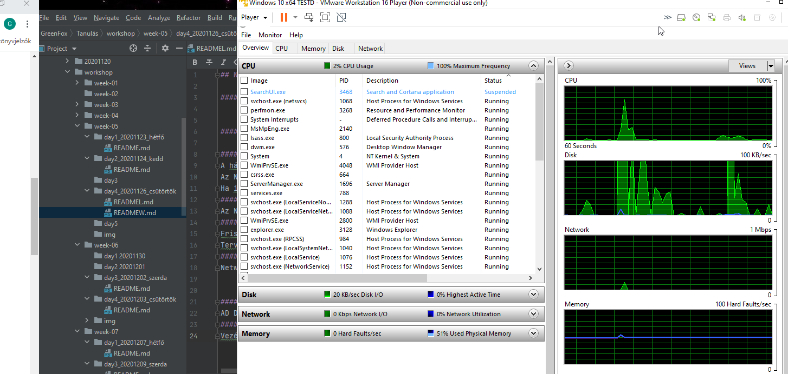

## Workshop20201126_csütörtök WINDOWS

#### Telepísünk fel egy Windows Server 2016 szervert 

#### Adjuk hozzá a szerverhez a Resource Monitor szolgáltatást

#### Mi az NTP szerver? Miért fontos ennek a beállítása?
A hálózati idő protokoll (angolul Network Time Protocol, NTP) számítógépes rendszerek óráinak szinkronizálására szolgáló hálózati protokoll. A protokoll csomagkapcsolt hálózaton keresztül működik. 
Az NTP az egyezményes koordinált világidőt szolgáltatja a szökőmásodperccel kiegészítve. Semmilyen más információt nem szolgáltat
Ha időeltolódás van a szerver és a kliens között kapcsolatvesztést eredményezhet.
#### Az NTP TCP vagy UDP porton kommunikál?
Az NTP User Datagram Protocolt (UDP) használ a 123-as porton keresztül.
#### Miért fontos az Windows Update használata? Nagyvállalati környezetben milyen módon szokták használni és milyen kritikus pontja vannak a rendszerek frissítésének?
Frissítések a biztonsági hibákat javítják
Tervezetten  előbb tesztkörnyezetben történjen. Fontos a biztonsági mentés. Karbantartási időben legyen frissítés
#### Hol tudjuk átállítani az elsődleges és másodlagos DNS szervert?
Network Connections/ Ethernet0/Properties/Internet protocoll VErsion 4/Properties/Use the folloving DNS server addresses.

#### Hol tudnánk a gépünket domain-be léptetni? Milyen jogosultság kell ehhez?
AD DS- ben, Domain Administrator jog kell
#### Tiltsuk le a tűzfalon a Remote Desktop használatát
Vezérlőpult > Windows tűzfal> Alkalmazások vagy szolgáltatások engedélyezése > A llow apps to communicate through Windows Firewall > Changes settings -> remote desktop pipa ki.