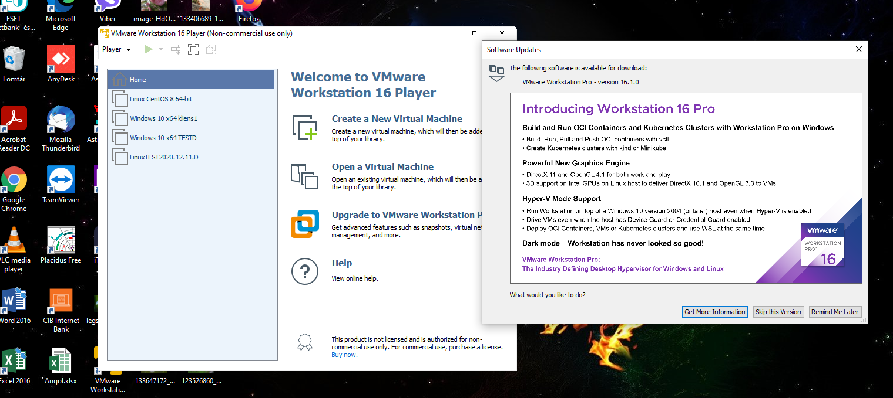

## Workshop

#### Telepítsünk fel egy VMware Workstation Player-t a Windows-os gépünkre

#### Lehet-e grafikus felület nélkül installálni, használni, üzemeltetni MS Windows operációs rendszert?
Igen. Asztali rendszereket nem , de core verziókat (szerver) igen.
#### Lehet-e grafikus felület nélkül installálni, használni, üzemeltetni Linux operációs rendszert?
Igen.
#### Lehet-e MS Windows Server-en futó alkalmazást futtatni Linux operációs rendszeren?
Amelyiknek van Linuxos verziója. 
A Wine alkalmazással Windows-alkalmazások futhatnak Linux-on.
#### Szükséges-e driver installálása MS Windows OS-ek alatt?
A jó öreg Windows-nak mindig szüksége van a gyártó által biztosított driverekre, mielőtt a hardvert használatba vehetnénk alatta. 
A Windows telepítésénél mindig telepítenünk kell a szükséges drivereket is alkatrészeinkhez. 
Alaplapi chipszet driverket, grafikus drivereket, wifi drivereket és még sok mást. 
A Windows szerencsére egyszerűvé teszi az emberek életét, mivel a legtöbb ilyen drivert Windows Update-ek formájában eljuttatja a felhasználókhoz. 
Amikor pedig egy új eszközt csatlakoztatunk a géphez, megszerzi az internetről a szükséges drivereket.

#### Szükséges-e driver installálása Linux OS-ek alatt?
Igen. Linux-on a driverek kicsit másképp működnek. 
A számítógép hardvereihez készült driverek nagy része nyílt forráskódú és eleve integrálva lett a Linux rendszerbe. 
A driverek általában szerves részei a kernelnek.
#### MS Windows alatt a registry-t milyen alkalmazással lehet menedzselni?
A tálcán található keresőmezőbe írja be a regedit kifejezést. Ezután válassza az első találatot ehhez: Beállításszerkesztő (asztali alkalmazás).
