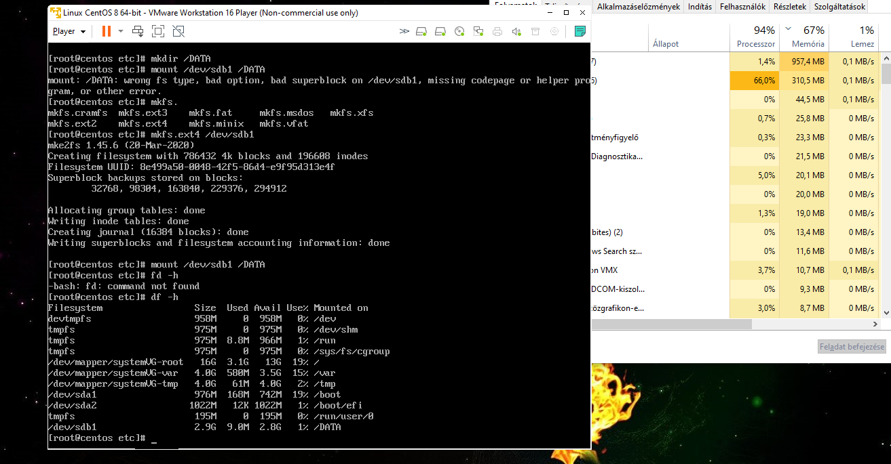

#Workshop Linux konfigurálás (első kör) 2020.12.02.

Material Review
Megismerni a Linux installációst kört követő legfontosabb első végrehajtandó lépéseket

Update/upgrade végrehajtása

Belépés korlátozása

Hálózati beállítások

Disk hozzáadása a rendszerhez
####*Végezzük el az LinuxTEST gép operációs rendszerének az update-jét. Hajtsunk végre a "yum update" parancsot, nézzük meg és elemezzük, hogy mit fog az installációt követően a rendszer update-elni!*

Frissíti a rendszert az aktuális verióra.

####Hajtsunk végre a "yum upgrade" parancsot, nézzük meg és elemezzük, hogy mit fog az "update"-et követően a rendszer upgrade-elni!
Az új verzióra frissíti a rendszert (ha a gyártó új verziót adott ki)
####Mi a különbség a „yum update” és „yum upgrade” parancs között? Mikor jelentkezik ennek a hatása? Okozhat-e problémát, és ha igen, akkor milyet?
ipdate esetén csak a jelenlegi kiadásra kiadott frissítéseket telepíti. Upgrade esetén az op. rendszer legújabb verzióját frissíti.

####Tiltsuk le az SElinux szolgáltatás indulását.
1. nano /etc/selinux/config
2. SELINUX=enforcing helyett SELINUX=disabled
3. mentés-ctrlO, és újraindítás

 

####Tiltsuk le, hogy távolról (SSH daemon-on keresztül) a "root" acounttal be lehessen lépni!
 - nano /etc/ssh/sshd_config 
 - PermitRootLogin yes ---> PermitRootLogin no
 - systemctl restart sshd
 
####Milyen más konfigurációs lépéseket kell előtte végrehajtani?
Létre kell hozni egy felhasználót és engedélyezni, hogy rendszergazdává váljon (su parancs)
 - nano /etc/sudoers
 - "username" ALL=NOPASSWD: /bin/su (jelszó nélküli belépés su paranccsal
 )
####Milyen veszélye és haszna van ennek a lépésnek?
jelszó nélküli root belépés miatt nem biztonságos, de mivel nincs jelszó, így nem tudják a szervert irányítani illetéktelenek.

####SSH használata esetében a hálózati forgalom "snoop"-olásával el lehet-e lopni a felhasználói névhez tartozó jelszavat?

Nem, mert a hálózati forgalom titkosított ssh esetén (secure shell)

####Milyen olyan távoli elérés (karakteres terminál) ismer, ahol el lehet a felhasználói nevet és jelszót olvasni a csomagok figyelésével?
Telnet

####Milyen megszorítások vannak egy Linux-os szerver elnevezésével kapcsolatban (operációs rendszer szinten)?
Nem kezdődhet (-) lel.
Teljes név 253 karakter lehet maximum.

####Milyen két módon lehet DNS szervert megadni Linux esetében?
  -  nslookup szerver paranccsal
  -  /etc /resolv.conf szerkesztésével.
  
####Ismertesse a DHCP működési elvét, és Linux konfigurációs beállításokat.
Dora process:
1. Discover (Felfedezés - üzenet az igényre)
2. Offer (Ajánlattétel - szerver dhcp-ből IP címet küld vissza)
3. Request (Kérés - elfogadás és esetleg további kérés)
4. Acknowledge (Jóváhagyás - DHCP ack üzenettel nyugtáz)

Linux DHCP beállítás: 
 - BOOTPROTO="dhcp"
 - DHCP_HOSTNAME="host_name"
 - DHCP_FQDN="host_name.local
 
####Ismertesse a statikus IP beállítás paramétereit!
 - TYPE="Ethernet"
 - PROXY_METHOD="none"
 - BROWSER_ONLY="no"
 - BOOTPROTO="static" (statikus IP cím)
 - DEFROUTE="yes"
 - ONBOOT="yes"
 - PEERDNS=no
 - IPADDR="192.168.31.41"  (Ipv4 cím)
 - PREFIX="24” (subnet mask)
 - DNS1="1.1.1.1" 
 - DNS2="8.8.8.8"
 - DOMAIN=”oktatas.local" ("host_name.local”)

####Miért preferált egyik és másik használata? Előnyök, hátrányok bemutatását adja meg egy táblázatban.
| DHCP         | Static |
| ----         |  ----- |
| Klienseken automatikus a beállítása | Klienseken manuális a beállítása. |
| Közepes, vagy Nagykiterjedésű hálózatban könnyebb a hálózat menedzselése, átláthatósága | Közepes , vagy Nagy kiterjedésű hálózatban rendkívül körülményes és könnyen kaotikussá válik a használata |
| Külön dhcp servert kell alkalmazni a hálózaton | Nem kell külön server szolgáltatást telepíteni
| Figyelni kell a speciális egyedi IP címet igénylő hálózati eszközökre | Nem igényel különösebb figyelmet fordítani a speciális , egyedi IP címet igénylő hálózati eszközök alkalmazásakor
| Az eszközök IP cím nyílvántartása automatikusan naplózott nem szükséges vezetni IP cím ütközés elkerüléséhez | Az eszközök IP cím ütközésének elkerüléséhez manuálisan kell nyílvántartást vezetni

 
 
####Statikus és LVM disk menedzsment közötti különbségek összehasonlítása.
Statikus esetben a tárterület nem bővíthető, Logical Volume esetén a mérete állítható, csak a ténylegesen használt területet foglalja le a disken.

####A ”Szerver HW” részben létrehozott LinuxTEST virtuális géphez csatoljuk fel az ISO-t. Mount-oljuk fel az /mnt könyvtárhoz. Nézzük meg a tartalmát. Keressük meg „telnet” programot. Az „rpm -ivh” segítségével installáljuk fel.

####Kérdezzük meg az IP címét a gépnek.
 - ifconfig
 - ifconfig ens33

####Az ethernet kártya IP címét módosítsuk statikusra, és a jelenlegi cím negyedik tagjában eltérőre.
- BOOTPROTO="static" 
- IPADDR="192.168.31.77" 
####NTP klienst állítsuk át az alábbi címektől való lekérdezésre: 0.hu.pool.ntp.org 1.hu.pool.ntp.org 2.hu.pool.ntp.org 3.hu.pool.ntp.org

Adjun(k egy plusz 10GByte-os disk-et a géphez, mount-oljuk fel a /DATA könyvtár alá.

 - fdisk (partícionálás)
 - mkfs.ext4 /dev/sdb1 (megformázás ext4-formátumra)
 - mkdir /DATA (DATA könyvtér létrehozása)
 - mount /dev/sdb1 /DATA (felmountolás)
####Lehet-e egy felhasználó több csoportnak a tagja is?
Igen.

####Lehet-e a swap méretét növelni? Ha igen milyen módon?
Igen. Új swap partíciót kell létrehozni(mkswap) és hozzáadni (swapon)
####Melyik állományban lehet beállítani, hogy távolról SSH szerveren keresztül csak saját felhasználói névvel lehessen belépni, a root felhasználóval ne?
/etc/ssh/sshd_config fájlban

####Lehet-e egy hálózati kártyán egynél több IP címe?

Igen. (virtuális ethernettel, vagy másodlagos IP cím))

####Mik az előfeltételei annak, hogy egy új 10GByte-os disk-et egy meghatározott könyvtár alá mount-oljunk?
 - Partícionálva legyen
 - formázva legyen fájlrendszerrel (ext4, xfs) 
 - egy hely (könyvtár) ahová csatoljuk