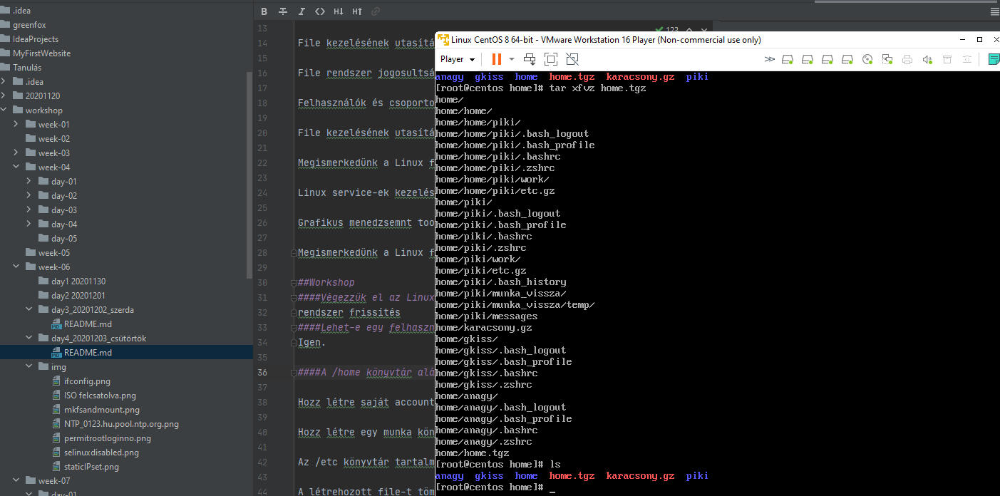
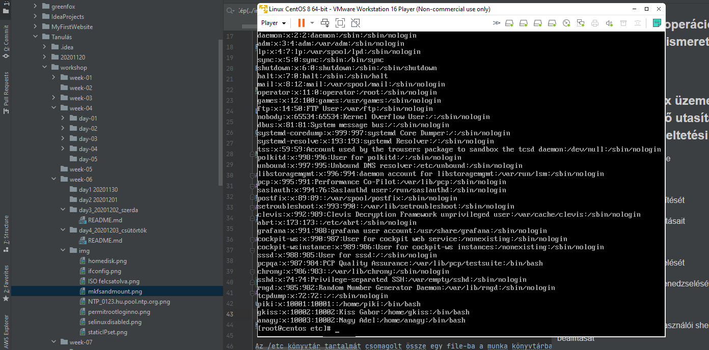
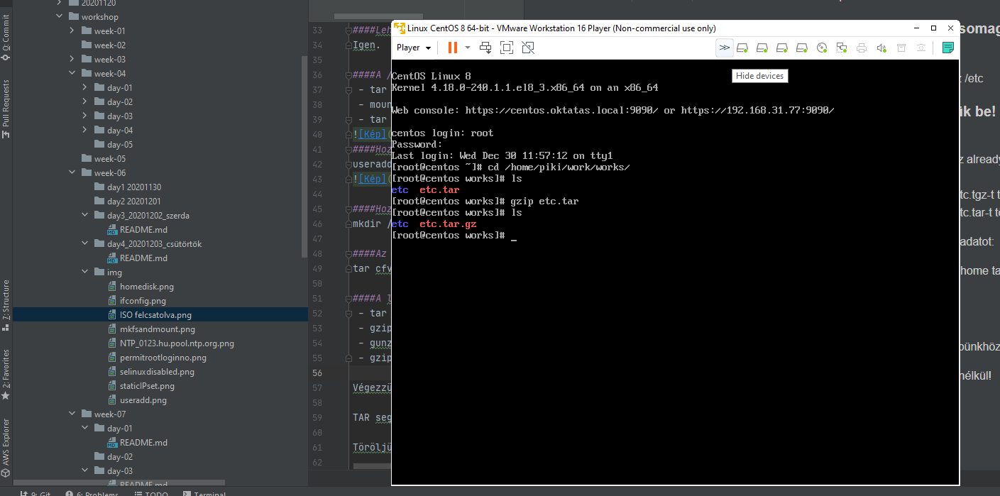
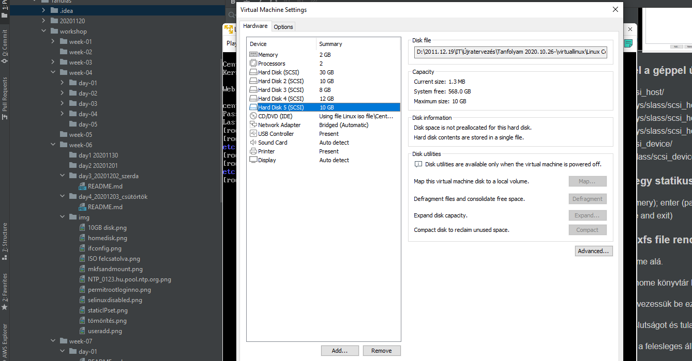
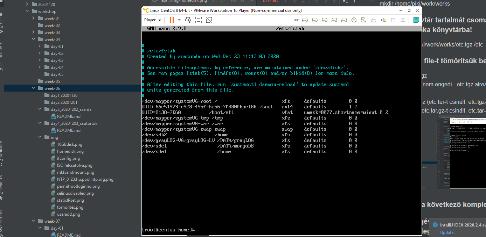
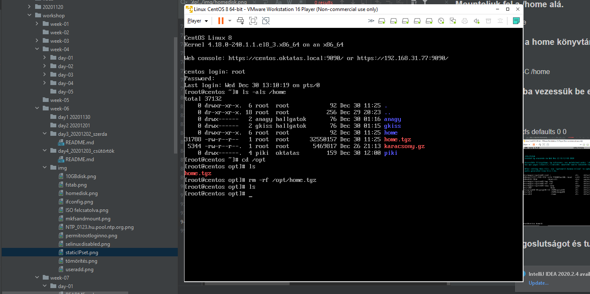

###Workshop - Linux operációs rendszer (CentOS 8.2) - alapismeretek (1)

###Material Review
###Megismerni a Linux üzemeltetéshez szükséges alapvető utasításokat, működési és üzemeltetési elveket

Konzol használat megismerése

Parancssor felépítését

Linux könyvtárszerkezet felépítését

Könyvtárak kezelésének utasításait

File kezelésének utasításait

File rendszer jogosultság kezelését

Felhasználók és csoportok menedzselését

File kezelésének utasításait

Megismerkedünk a Linux felhasználói shell környezetet, beállítását

Linux service-ek kezelését

Grafikus menedzsemnt tool használatát - Cockpit

Megismerkedünk a Linux felhasználói shell környezetet, beállítását

##Workshop
####Végezzük el az LinuxTEST gép operációs rendszerének az update-jét. Hajtsunk végre a "yum update" parancsot, nézzük meg és elemezzük, hogy mit fog az installációt követően a rendszer update-elni!
rendszer frissítés
####Lehet-e egy felhasználó több csoportnak is a tagja?
Igen.

####A /home könyvtár alá csatoljunk disk-et. Eddigi tartalma ne vesszen el!
 - tar cfvz home.tgz /home
 - mount /dev/sdb1 /home
 - tar xfvz home.tgz -C /home

####Hozz létre saját account-ot!
useradd -g 10001 -u 10001 'accountname'

####Hozz létre egy munka könyvtárt a saját munkakönyvtáradban!
mkdir /home/piki/work/works 

####Az /etc könyvtár tartalmát csomagolt össze egy file-ba a munka könyvtárba!
tar cfvz /home/piki/work/works/etc.tgz /etc

####A létrehozott file-t tömörítsük be!
 - tar xfvz etc.tgz
 - gzip etc.tgz   (nem engedi - etc.tgz already has .tgz suffix  -- unchanged)
 - gunzip etc.tgz (etc.tar-t csinált, etc.tgz-t törölte)
 - gzip etc.tar (etc.tar.gz-t csinált, etc.tar-t törölte)

####Végezzük el a következő komplex feladatot:
####TAR segítségével csomagoljuk be a /home tartalmát és tegyük a file-t a /opt alá.
tar cfvz /opt/home tgz /home 
####Töröljük le a /home tartalmát.
rm -rf /home/
####Adjunk egy 10 GByte-os disk-et a gépünkhöz!
VMware-ben

####Fedeztessük fel a géppel újraindítás nélkül!
 - ls /sys/class/scsi_host/
 - echo "- - -" > /sys/class/scsi_host/host0/scan
 - echo "- - -" > /sys/class/scsi_host/host1/scan
 - echo "- - -" > /sys/class/scsi_host/host2/scan
 - ls /sys/class/scsi_device/
 - echo 1 > /sys/class/scsi_device/0:0:0:0/device/rescan
 
####Hozzunk létre egy statikus partíciót!
 - fdisk /dev/sde 
 - n (new); 
 - p (primery); 
 - enter v. 1 (partition number 
 - enter (partition first sector from2048)
 - enter (partition last sector,20971519)
 - w (write table to disk and exit)
 
####Formatáljuk le xfs file rendszerrel!
mkfs.xfs -L STAIKUS /dev/sde1
####Mountoljuk fel a /home alá.
mount /dev/sde1 /home

####TAR-oljuk vissza a home könyvtár betarolt tartalmát!
tar xfvz /opt/home.tgz -C /home
####Az /etc/fstab file-ba vezessük be ezt a mount point-ot!
 - nano /etc/fstab
 - /dev/sde1    /home   xfs     defaults    0 0
 
####Ellenőrizzük a jogoslutságot és tulajdonjogot a /home alatt!
ls -als /home
#####Töröljük az /opt alól a felesleges állományt!
rm -rf /opt/home.tgz

