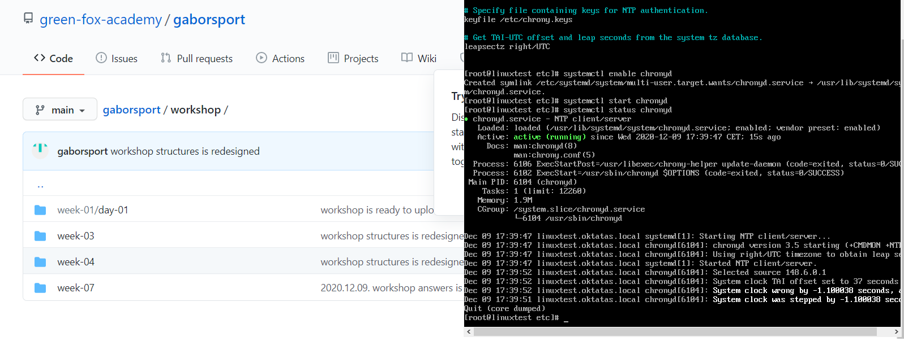
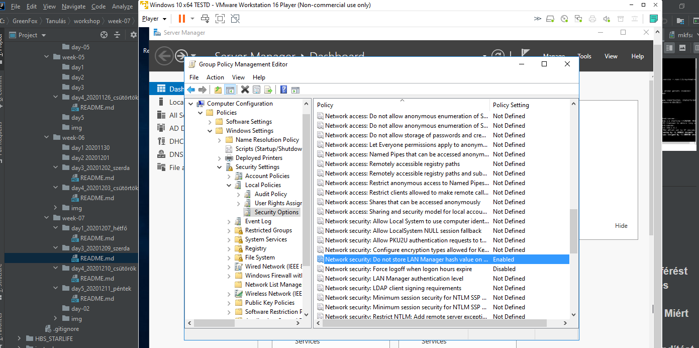
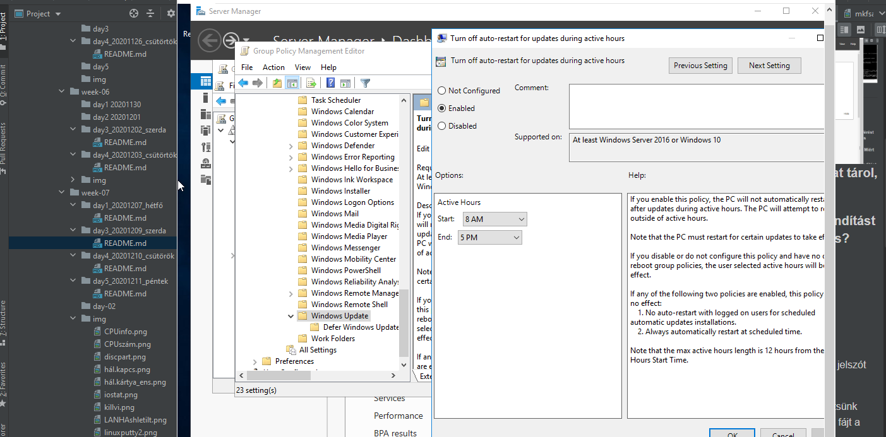
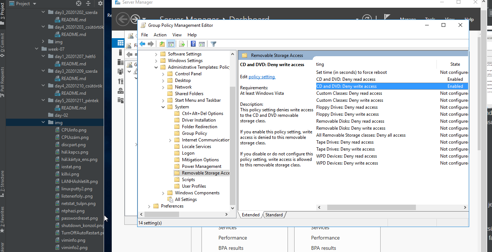
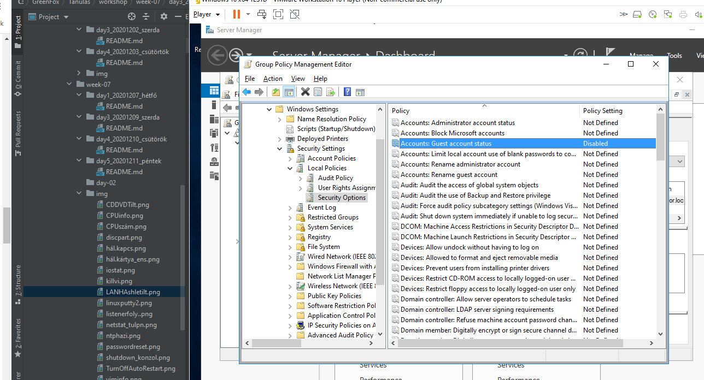
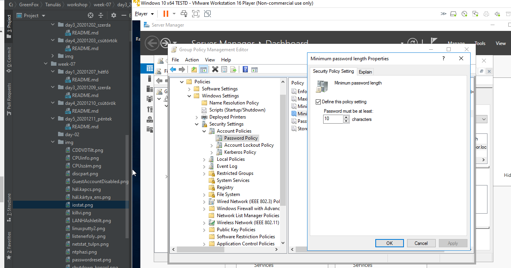
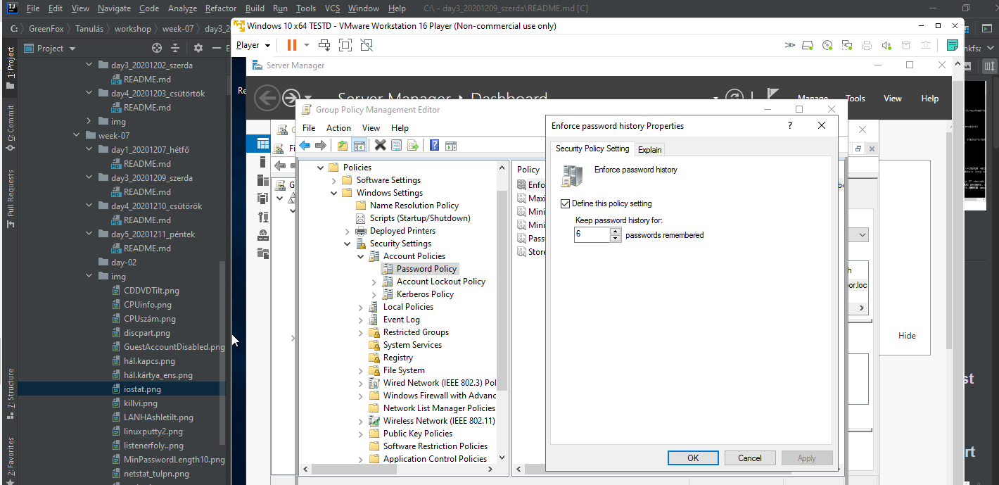

##2020.12.09.
###Workshop
####Készítsünk egy GPO-t a következő beállításokkal

<h4> Korlátozzuk a Vezérlőpulthoz való hozzáférést (készítsünk egy felhasználót az AD-ben és állítsuk be arra a felhasználóra)

<h4> Tiltsuk le a LAN Manager Hash tárolását. Miért szükséges letiltani?

 Biztonság miatt. LAN Manager jelszavakat tárol, amik feltörhetőek, így jobb, ha letiltjuk.
 Dashboard-->Group Policy Management --> Default Domain Policy (edit) --> Computer Configuration --> Policies --> Windows Settings--> Security Settings--> LocalPolicies --> Security Options --> Network Security:Do not store LAN manager hash value tiltásának az engedélyezése

####Tiltsuk le a kikényszerített rendszer-újraindítást (Windows Update). Miért lehet ez hasznos?

Munkaórák altt (beállítás kérdése, mikor) nem fog a rendszer újraindulni (az  aktív órák száma 12 óra lehet)
És biztonsági okból:-)
#### Tiltsuk le a cserélhető adathordozó-meghajtókat (CD,DVD)
Dashboard-->Group Policy Management --> Default Domain Policy (edit) --> User Configuration --> Policies --> Administrative Templates -->System --> REmovable Storage Acces -->CD DVD írás olvasás tiltásának az engedélyezése

 
####Tiltsuk le a Guest accountot (Vendég fiók)
Dashboard-->Group Policy Management --> Default Domain Policy (edit) --> Computer Configuration --> Policies --> Windows Settings--> Security Settings--> LocalPolicies --> Security Options --> Account: Guest account status tiltása.

####Állítsuk a minimális jelszó hosszt 10-re
Dashboard-->Group Policy Management --> Default Domain Policy (edit) --> Computer Configuration --> Policies --> Windows Settings--> Security Settings --> Account Policies --> Password Policy, minimum password length=10.

#### Állítsuk be a rendszert úgy, hogy az utoljára használt 6 jelszót jegyezze meg (Password history)
Dashboard-->Group Policy Management --> Default Domain Policy (edit) --> Computer Configuration --> Policies --> Windows Settings--> Security Settings --> Account Policies --> Password Policy -->Enforce password history=6.

#### Hozzunk létre egy mappát a C: meghajtón, majd készítsünk benne egy valami.txt fájlt. Állítsuk be, hogy a valami.txt fájt a Domain Users felhasználók csak olvasni tudják.

#### Mi az NTDS.DIT? Hol találom meg?
| Fizikai tárolás |

 -  Általában nem szükséges az Active Directory adatbázisát fájl szinten manipulálni, de mindenképpen érdemes tudni, hogy mely fájlokban milyen adatok tárolódnak, valamint ezek a fájlok pontosan hol is helyezkednek el a fájlrendszerben. A fájlok helye a %systemroot%\NTDS mappa, ahol a %systemroot% a rendszerpartíción elhelyezkedő Windows mappát jelenti és alapértelmezésben a C:\Windows. A legfontosabb fájl az Ntds.dit, amely tulajdonképpen az Active Directory adatbázist tárolja. A fájlnév kiterjesztése is ezt jelzi. (Directory Information Tree – DIT)
 -  Edb.log – a fájlban a tranzakciónapló található, amelynek tartalma
    azonnal követi a címtár minden változását. A változások aztán később, a
    megfelelő pillanatban átkerülnek végleges helyükre, az ntds.dit-be. A fájl
    maximális mérete 10 MB. 
    

#### Mit jelent a kvótázás? Milyen fájlrendszerben található meg?
Célszerű a felhasználókat bizonyos korlátok közé szorítani, hogy ne pazarolják feleslegesen a tárhelyet. Erre szolgál a kvóta. Megadhatunk tárterület méretet, amelyet a felhasználó nem léphet túl. A foglaltság mértékéről a rendszer képes értesíteni a rendszergazdát. Alapesetben a felhasználók a háttértár egész méretét használhatják. Kvóták kezeléséhez fel kell telepíteni a File Server Resource Managert. (Kiszolgálókezelő/kezelés vagy a megosztásoknál a kvótáknál)

#### Mit csinál a következő parancs? C:>ipconfig /flushdns 
 - Kiűríti a DNS-gyorsítótárat. A DNS-feloldó gyorsítótár kitűrítése elősegítheti a DNS-sel kapcsolatos problémák megoldását a Microsoft Windows 10 rendszerben.
 - Az ipconfig /flushdns a DNS-címet frissíti, ami hálózati problémák megoldásakor is jól jön.

#### Mi a különsbség a Forward és a Reverse Lookup Zone között?
 - Forward lookup zone (címkeresési zóna) - Domain névből IP címet ad vissza - A
 - Reverse lookup zone (névkeresési zóna) - IP címből Domain nevet (host nevet) adja vissza - PTR
#### Az Active Directory telepítésekor alapértelmezés szerint melyik két csoportházirend- objektum jön létre ?
Az Active Directory telepítésekor alapértelmezés szerint két nem helyi csoportházirend-objektum jön létre:
1. A Default Domain Policy (Alapértelmezett tartományi házirend) a tartományhoz van kötve, és házirend-öröklődés révén a tartományba tartozó összes felhasználóra és számítógépre (köztük a tartományvezérlő számítógépekre is) érvényes.
2. A Default Domain Controllers Policy (Alapértelmezett tartományvezérlői házirend) gyárilag a Domain Controllers (Tartományvezérlők) nevű szervezeti egységhez van csatolva, és jellemzően csak a tartományvezérlőkre van hatással, mivel a tartományvezérlők számítógépfiókjait általában ezen a helyen tároljuk (hacsak ki nem vesszük innen valami nagyon alapos okból).
#### Melyik zónában találunk A-rekordot és melyikben PTR-t ?
 - A-rekord: Forward lookup zone
 - PTR(pointer): Reverse lookup zone