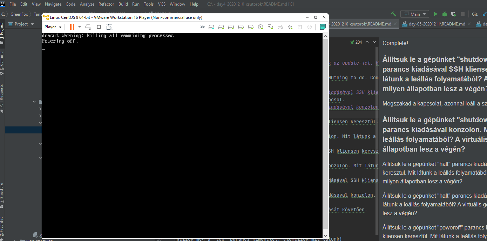
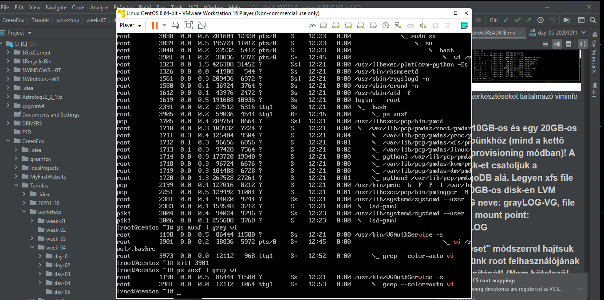
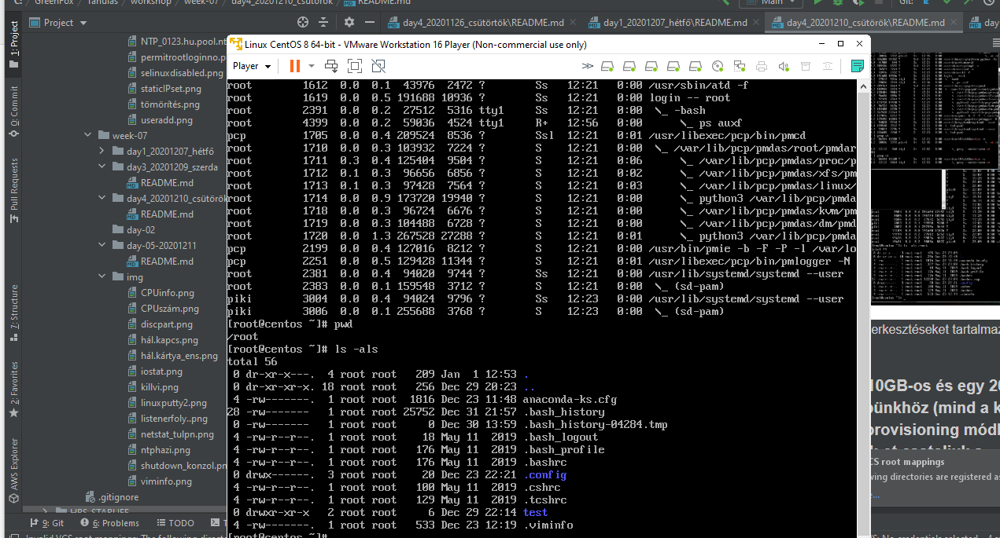
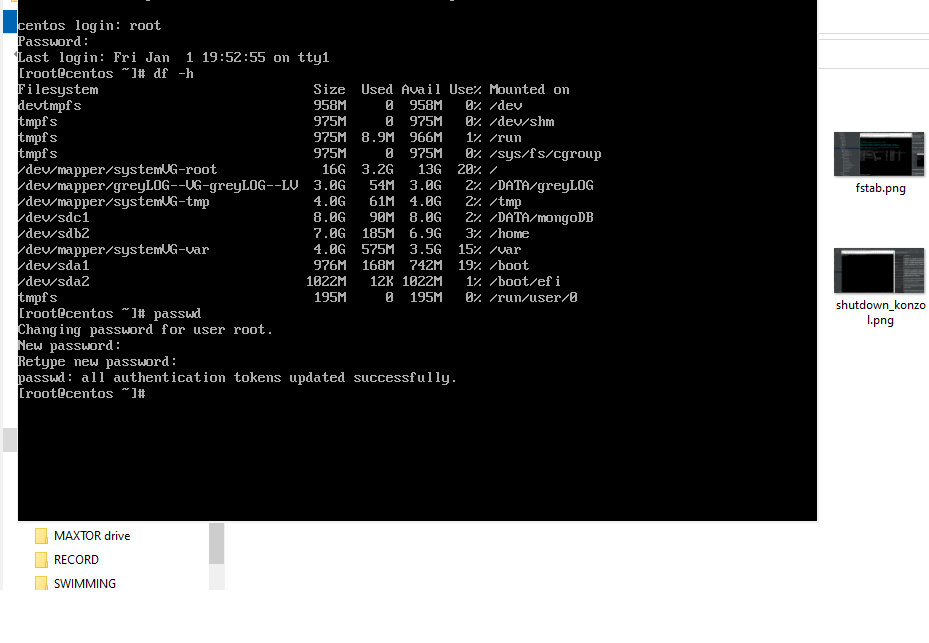

###Workshop 20201210 Linux alapismeretek 2
####Végezzük el az LinuxTEST gép operációs rendszerének az update-jét. Hajtsunk végre a "yum update" parancsot, nézzük meg és elemezzük, hogy mit fog az installációt követően a rendszer update-elni!
A legutóbbi frissítéseket (ha van) fogja telepíteni.
DLast metadata expiration check. ependences resolved. NOthing to do. Complete!
 
####Állítsuk le a gépünket "shutdown -h now" parancs kiadásával SSH kliensen keresztül. Mit látunk a leállás folyamatából? A virtuális gép milyen állapotban lesz a végén?
Megszakad a kapcsolat, azonnal leáll a szerver és kikapcsol.
####Állítsuk le a gépünket "shutdown -h now" parancs kiadásával konzolon. Mit látunk a leállás folyamatából? A virtuális gép milyen állapotban lesz a végén?
leállási folyamat, ami nagyon  gyors, killing all remaining processes, a végén powering off

####Állítsuk le a gépünket "halt" parancs kiadásával SSH kliensen keresztül. Mit látunk a leállás folyamatából? A virtuális gép milyen állapotban lesz a végén?
A hálózati kapcsolat megszakad, a virtuális gép CPU-ja kikapcsol, de nekünk kell power off-fal vagy reset-tel újraindítani. 
The CPU has been disabled by the guest operating system. Power off or reset the virtual machine.
####Állítsuk le a gépünket "halt" parancs kiadásával konzolon. Mit látunk a leállás folyamatából? A virtuális gép milyen állapotban lesz a végén?
Killing all remaining processes. Halting.
The CPU has been disabled by the guest operating system. Power off or reset the virtual machine.
####Állítsuk le a gépünket "poweroff" parancs kiadásával SSH kliensen keresztül. Mit látunk a leállás folyamatából? A virtuális gép milyen állapotban lesz a végén?
kapcsolat megszakad SSH-n, virtuális gép kikapcsol (powering off)

####Állítsuk le a gépünket "poweroff" parancs kiadásával konzolon. Mit látunk a leállás folyamatából? A virtuális gép milyen állapotban lesz a végén?
killing all remaining processes powering off
####Indítsuk újra a gépünket "shutdown -r now" parancs kiadásával SSH kliensen keresztül. Mit látunk a leállás folyamatából? A virtuális gép milyen állapotban lesz a végén?
kapcsolat megszakad, a virtuális gép újraindul.
####Indítsuk újra a gépünket "shutdown -r now" parancs kiadásával konzolon. Mit látunk a leállás folyamatából? A virtuális gép milyen állapotban lesz a végén?
Virtuális gép újraindul.

####Elemezzük ki a "dmesg" parancs kimenetét egy gép indítását követően.
 - A dmesg egy rövídítésből képzett mozaikszó: display and driver messages (or diagnostic messages)
Egy debug üzenet az operációs rendszer indulásával, majd később a kernel üzenetei számára. A linux parancs hatására megkapjuk az indulás során felismert hardware eszközöket, a hozzájuk társított kernel modulok, az egyéb betöltött modulok betöltését, az esetleges válaszukat. Megtalálhatjuk a hardware eszközök paramétereit.
kiválasztott/beállított kernel betöltése

device driver-ek (kernel modul) betöltése

harddware elemek azonosítása

service-ek indítása

Erről a folyamatról kapunk információt, a futás eredményéről, mint egy log információt kapunk ezzel a paranccsal.

####Elemezzük ki a "ps auxf" parancs kimenetét!
 A  ps  program  az  aktuális  processzek  pillanatfelvételét adja. Amennyiben az
        állapotok ismétlődő frissítésére van szükség, a top használata javasolt.
 - ps - Pillanatnyi kép a futó proceszekről.
 - a - a többi felhasználó processzeit is kijelzi
 - u - felhasználói (user) formátum: megadja  a  felhasználó  nevét  és  a  kezdés  idejét
 - f -  ``erdő'' ("forest") a parancssor családfáját adja meg
 - x - a terminálhoz nem csatlakozó processzeket is kijelzi
 
####Nézzük meg a "top" parancs kimenetét, elemezzük mit látunk!
 - Fő feladata, hogy mutassa valós időben a folyamatok listáját, folyamatosan frissítve az aktuális állapottal.
 - Folyamat PID-ja, felhasználója, CPU és memória használat figyelése százalékosan,legfelül a legtöbbet igénylő folyamat
 - A top parancs nagyon hasznos a rendszergazdák számára, akik folyamatosan figyelni tudják, melyik felhasználó igényel a legtöbb kapacitást.
 -  A folyamatok nem valós idejű listájának kiírásához használjuk a ps parancsot.
####Indítsunk egy SSH kliensen keresztüli belépést. Belépést követően indítsunk egy "vi /root/.bashrc" parancsot. Lépjünk be konzolon. A "ps auxf" segítségével keressük ki a "vi" parancsunkat. A szülő shell-jét "kill" segítségével állítsuk le! Majd ellenőrizzük a "ps auxf" segítségével a hatását process szinten. Végezetül mit találunk a /root könyvtárban ami eddig nem volt ott?

A félbemaradt szerkesztéseket tartalmazó viminfo nevű fájl.
####Adjunk egy 10GB-os és egy 20GB-os disk-et a gépünkhöz (mind a kettő legyen thin provisioning módban)! A 10GB-os disk-et csatoljuk a /DATA/mongoDB alá. Legyen xfs file system. A 20GB-os disk-en LVM legyen. A VG neve: grayLOG-VG, file system: xfs, mount point: /DATA/grayLOG
 - 10GB (thin provisioning)
 - fdisk -l (csak listáz)
 - mkfl.xfs /dev/sdc1
 - mkdir -p /DATA/mongoDB /DATA/grayLOG
 - mount /dev/sdc1 /DATA/mongoDB
 - df -h
 - cp fstab fstab.orig
 - nano fstab
 - /dev/sdc1    /DATA/mongoDB   xfs defaults    0 0
-----------------
egy kis módosítással (disk: 13GB, LVM: 2GB, mount point: /DATA/greyLOG)
 - fdisk -l
 - fdisk /dev/sdf
 - pvcreate /dev/sdf1
 - vgcreate greyLOG-VG /dev/sdf1
 - lvcreate -n greyLOG-LV --size 2G greyLOG-VG
 - mkfs.xfs /dev/greyLOG-VG/grey-LV
 - mkdir -p /DATA/greyLOG
 - mount /dev/greyLOG-VG/greyLOG-LV /DATA/greyLOG
 - df -h
 - cp fstab fstab.20210101
 - nano /etc/fstab
 - /dev/greyLOG-VG/greyLOG-LV   /DATA/greyLOG   xfs   defaults  0 0
 - df -h
 
####"Pasword reset" módszerrel hajtsuk végre a gépünk root felhasználójának jelszó módosítását! (Nem kötelező! Aki végrehajtja: óvatosan!)
