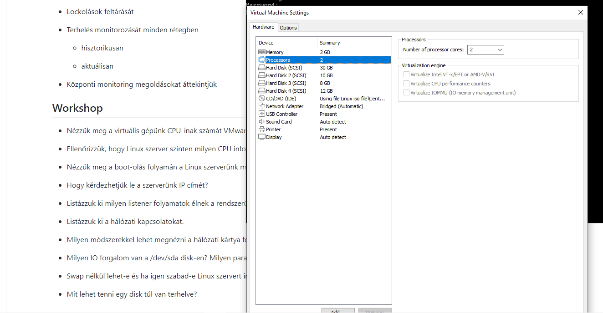
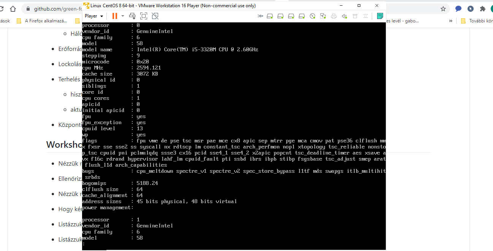
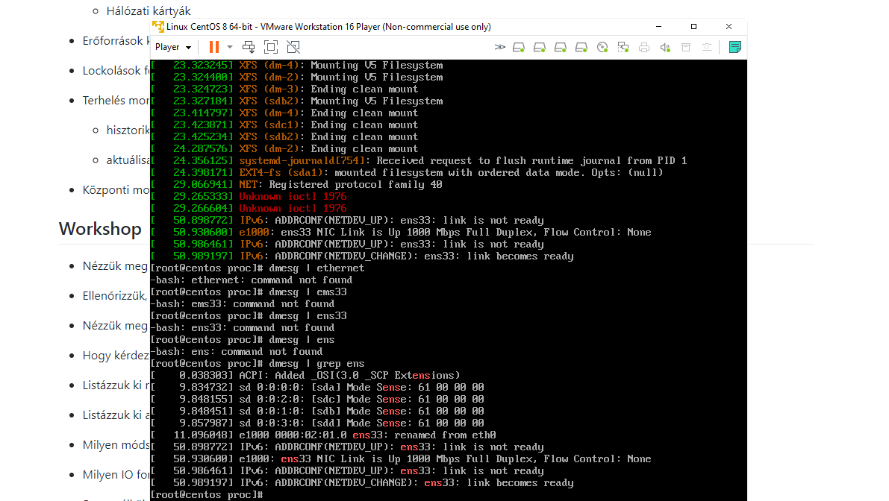
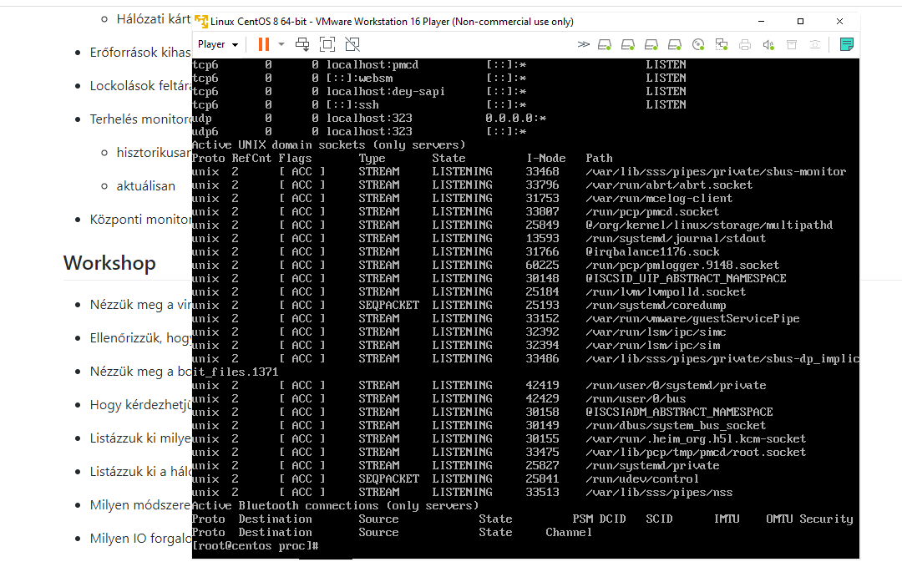
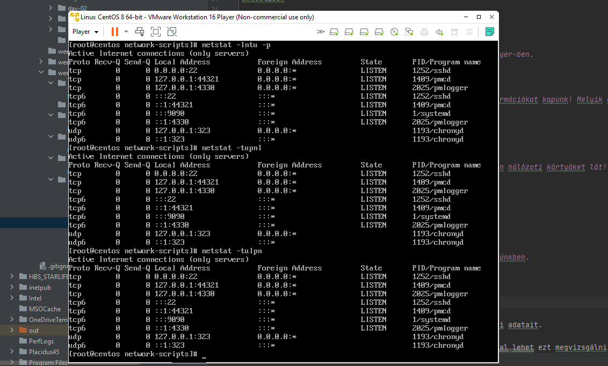
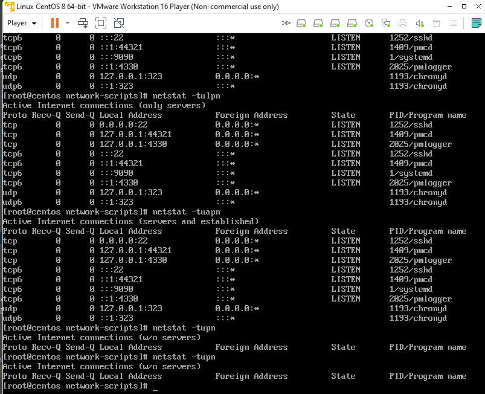
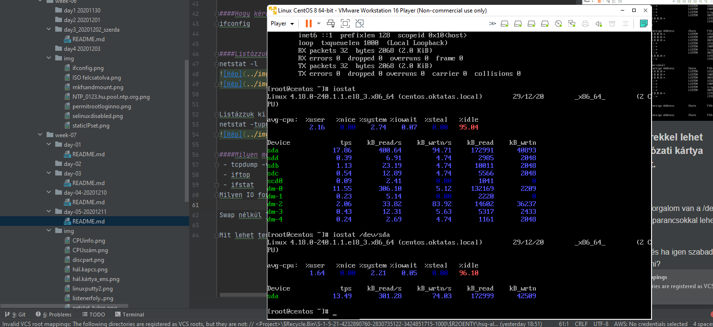

Material Review 20111211
Megismerni a Linux hardware eszközeinek feltérképezését

CPU-k feltérképezése

Memória feltérképezése

Disk alrendszer

PCI eszközök

Hálózati kártyák

Erőforrások kihasználtságának a feltérképezését

Lockolások feltárását

Terhelés monitorozását minden rétegben

hisztorikusan

aktuálisan

Központi monitoring megoldásokat áttekintjük

###Workshop
####Nézzük meg a virtuális gépünk CPU-inak számát VMware Player-ben.

####Ellenőrizzük, hogy Linux szerver szinten milyen CPU információkat kapunk! Melyik állomány tartalmát kell kiíratni?
 - cd /proc
 - ls -als | grep cpu
 - cat /proc/cpuinfo

####Nézzük meg a boot-olás folyamán a Linux szerverünk milyen hálózati kártyáket lát!
driver message
 - dmesg | grep ens

####Hogy kérdezhetjük le a szerverünk IP címét?
 - ifconfig
 - ip a

####Listázzuk ki milyen listener folyamatok élnek a rendszerünkben.
 - netstat -lntu -p (kilistázza  a listenereket)
 - netstat -antu -p (kilistázza a listenereket és az összes kapcsolatot)

####Listázzuk ki a hálózati kapcsolatokat.
netstat -tupn

####Milyen módszerekkel lehet megnézni a hálózati kártya forgalmi adatait.
 - tcpdump -v
 - iftop (Telepíteni kell, az alap installációnak nem része: yum install iftop)
 Listázza a kapcsolatokat dinamikusan (másodpercenkénti frissítéssel). Megkapjuk a kapcsolat forgalmazási adatait, végezetül alul az összegzést.
 
 - ifstat
 - nload -m (Interface-ek forgalmi adatát adja meg dinamikusan (másodpercenkénti frissítéssel).
  Telepíteni kell, az alap installációnak nem része: yum install nload)
 - iptraf-ng (Interface-ek forgalmi adatát adja meg dinamikusan (másodpercenkénti frissítéssel). Telepíteni kell, az alap installációnak nem része: yum install iptraf). Karakteres felületű, menü vezérelt.
 - vnstat (Interface-ek forgalmi adatát adja meg dinamikusan (másodpercenkénti frissítéssel).
   Telepíteni kell, az alap installációnak nem része: yum install vnstat
   A vnstatd service gyűjti folyamatosan az adatokat, amit később a vnstat paranccsal lehet lekérdezni.)
   
 
     
                       
####Milyen IO forgalom van a /dev/sda disk-en? Milyen parancsokkal lehet ezt megvizsgálni?
iostat /dev/sda

####Swap nélkül lehet-e és ha igen szabad-e Linux szervert indítani?
 - Lehet, de nem szabad (Swap - ha túlcsordul aprogram és nincs elég memória, akkor szerver felületet használ, mem. kétszerese, max 16GB)
 - Linux rendszert installálni és üzemeltetni stabilan nem lehet swap partíció nélkül. Fontos tudni, hogy nem file (mint a MS Windows-ban), hanem partíció! Akár többet is lehet használni.
 
####Mit lehet tenni egy disk túl van terhelve?
Területet felszabadítani (tmp törlése) vagy területet hozzáadni.
