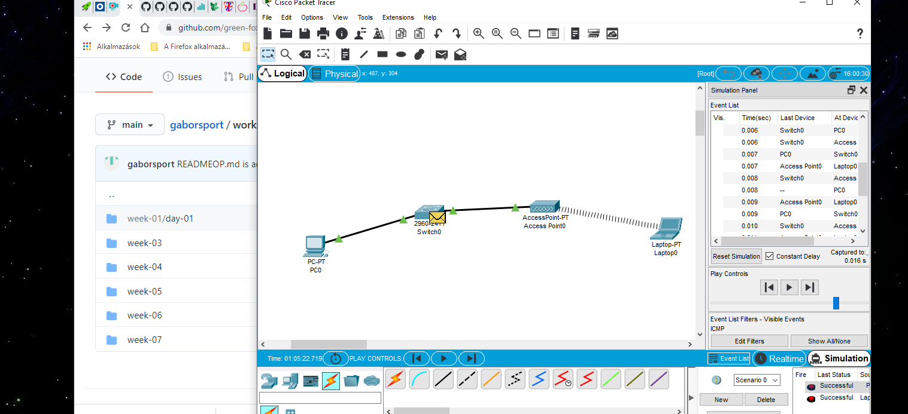
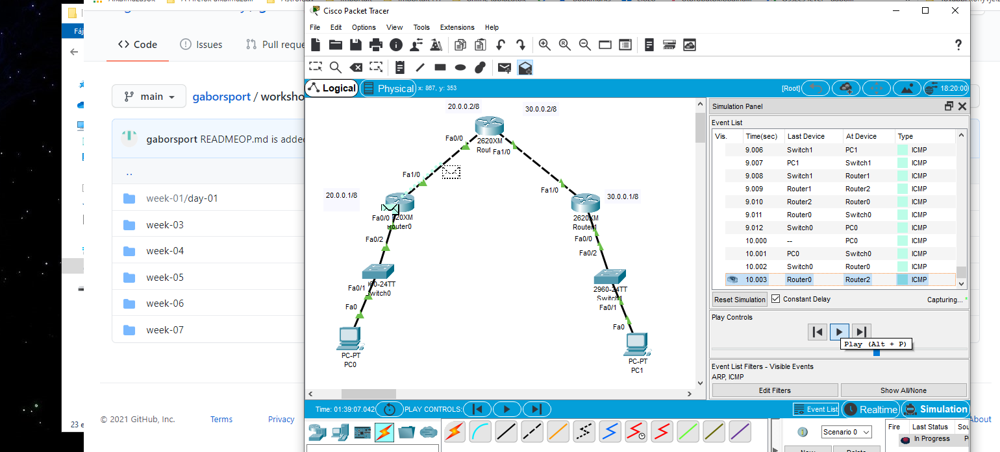

## Workshop
#### Nézzünk utána mi a különbség az ADSL és a bérelt vonal között? Melyiket használják enterprise környezetben és miért?
Az ADSL (Asymmetric Digital Subscriber Line – vagyis „aszimmetrikus digitális előfizetői vonal”) egy kommunikációs technológia, ami a hagyományos modemeknél gyorsabb digitális adatátvitelt tesz lehetővé a csavart rézérpárú telefonkábelen.

Az ADSL jellemzője a DSL megoldásokon belül, hogy a letöltési és a feltöltési sávszélesség aránya nem egyenlő (vagyis a vonal aszimmetrikus), amely az otthoni felhasználóknak kedvezve a letöltés sebességét helyezi előnybe a feltöltéssel szemben, általában 8:1 arányban.

Technikailag a bérelt vonal egy szimmetrikus adatkapcsolatot jelent, amelynek fix sávszélessége van. 
A bérelt vonal legfontosabb előnyei
1. Nagyobb sebesség. A hagyományos internetkapcsolat esetén a sebességet több tényező is befolyásolja, például az, hányan használják egyszerre a vonalat, illetve az általuk le- és feltöltött adatok mérete és típusa. Ezért van az, hogy csúcsidőben az internet lelassul. Bérelt vonal esetén azonban egészen más a helyzet!

2. Megbízhatóság. A bérelt vonali kapcsolatokhoz általában optikai kábeleket használnak, amelyek nem hajlamosak az elektromos interferenciára, fizikailag erősebbek és gyorsabb adatátvitelt biztosítanak.

3. Biztonság. A bérelt vonalak sokkal nagyobb biztonságot nyújtanak, mint szélessávú társaik. Mivel az adatkapcsolat a vállalkozás által ellenőrzött különböző pontok között létesül, Ön valójában nem osztja meg az adatokat egy nyilvános adathálózaton.

4. Távoli munkavégzés. A bérelt vonalak egyik hatalmas előnye, hogy lehetővé teszik az alkalmazottak számára az otthoni számítógépeikhez való biztonságos csatlakozást. Ez a megnövekedett rugalmasság segítheti a vállalkozásokat olyan rugalmas munkahelyi környezet kialakításában, amelyet az alkalmazottak felértékelnek.

#### Kérdezzük le az otthoni gépünk IP beállításait. Milyen osztályú IP címmel rendelkezünk?
Ipv4, C oszt. IP cím , 24-es subnetmask (prefix)
#### Milyen parancsokkal tudjuk felszabadítni, majd új IP címet igényelni a gépünk számára?
Windows:
 - ipconfig /release ( hálózati kártya felszabadítás)
 - ipconfig /flushdns (DNS címek felszabadítása)
 - ipconfig /renew (IP cím megújítás)

Linux:
 - To release the current IP address:
 - $ sudo dhclient -r
 - To obtain a fresh lease:
 - $ sudo dhclient 
#### Kérdezzük le az otthoni gépünk ARP tábláját
arp -a paranccsal
ARP protokoll feladata: a hálózati rétegbeli cím alapján az adatkapocslati rétegbeli cím felderítése. Azaz az IP cím segítségével visszaadja a MAC címet. Minden csomópont egy táblázatban (ARP táblázat) tartja nyilván a hálózati címekhez tartozó fizikai címeket. A táblázat új bejegyzéseit emberi beavatkozás nélkül kell létrehozni:

ARP kérdés: Ki tudja az X hálózati cím fizikai címét?

A kérdés keretét üzenetszórásos küldéssel az alhálózat valamennyi csomópontja megkapja és feldolgozza.

Ha valamely csomópont “magára ismer“ az X hálózati címben, akkor a saját fizikai címével megválaszolja az ARP kérdést.
#### Mit mutat az MX rekord és hogyan tudjuk lekérdezni?
Az MX (mail exchanger) rekordok a Domain Name System részei, feladatuk az adott domain e-mailjeit kezelő szervereinek azonosítása. Egy domainnek több MX rekordja is lehet, mely rekordok közt egy sorszám állít fel prioritási rangsort. Mindig a kisebb számmal rendelkező MX-rekord az elsődleges szerver. Fontos, hogy címre (A rekord), vagy CNAME rekordra mutató host megadása nem engedett.

How do I check my MX record?
1. To use NSLOOKUP to view MX records:
2. Open a command prompt.
3. Type "nslookup" then press Enter. You will see the following: Default Server: <FQDN of your server> ...
4. Type "set type=mx" then press Enter.
5. Type the domain name that you want to look up, then press Enter. The MX records of that domain will appear.
#### Milyen paranccsal kérdeznéd le, hogy a géped milyen TCP/UDP portokon figyel éppen (aktív kapcsolatok)?
Forgalom „lehetőségét” biztosító lekérdezés, mely megmutatja, hogy milyen listener-ek vannak a rendszerben (listener = olyan szerver szolgáltatás, amely vár a kliens kapcsolatfelvételére) és/vagy milyen hálózati kapcsolatok.
 
 Két alapvető listát szoktunk lekérni:
 - netstat -lntup (kilistázza a listenereket) (l: display listening, n: not resolve names, t: TCP ports, u: UDP ports, show PID)
 - netstat -antup (kilistázza a listenereket és az összes kapcsolatot)

#### Milyen parancsot használnál, ha csak! a géped MAC címét szeretnéd kiiratni (Windows parancsosrban)
getmac -v
#### Mire szolgál a tracert parancs? Mikor és mire használnád?
A tracert egy windows parancssori program. Feladata egy cél eszköz elérésének diagnosztizálása a közben érintett állomásokkal együtt. Ez utóbbi tulajdonsága miatt kifinomultabb mint a ping parancs. Hálózatos eszközökön traceroute néven ismert.

tracert IP_cím
Ahol az IP_cím a cél eszköz IP címe, amely helyett a cél DNS nevét is használhatjuk.

#### Hálózatunkon nincs engedélyezve a 3389-es port. Milyen szolgáltás nem fog működni?
Távoli asztal

Remote Desktop Protocol (RDP) is a Microsoft proprietary protocol that enables remote connections to other computers, typically over TCP port 3389.
#### Mik a privát IP tartományok?
| RFC 1918 név	| IP címtartomány	| Címek száma	| Classful leírás	| Legnagyobb CIDR blokk (alhálózati maszk)	| Hosztazonosító mérete | 
| ------------- | ----------------- | ------------- | ----------------- | ----------------------------------------- | --------------------- | 
| 24 bites blokk	| 10.0.0.0 – 10.255.255.255	| 16 777 216	| Egyetlen A osztály	| 10.0.0.0/8 (255.0.0.0)	| 24 bit |
| 20 bites blokk	| 172.16.0.0 – 172.31.255.255	| 1 048 576	16 | szomszédos B osztály	| 172.16.0.0/12 (255.240.0.0)	| 20 bit |
| 16 bites blokk	| 192.168.0.0 – 192.168.255.255	| 65 536	| 256 szomszédos C osztály	| 192.168.0.0/16 (255.255.0.0)	| 16 bit |

#### Mi a subnet maszk?
A hálózati maszk (netmask): Egy olyan 32 bites maszk, mely 1-es bit értékeket tartalmaz a hálózat és alhálózat azonosításában résztvevő bithelyeken, és 0-ás bit értékeket tartalmaz a csomópont azonosítására szolgáló bithelyeken.

A hálózati maszk segítségével az eredetileg az osztályba sorolás által (statikusan) meghatározott hálózat-gép határ módosítható.
#### Mi a default gateway?
Az a hálózati csomópont, amelynek a gép azokat a csomagokat küldi, amelyek nem a helyi hálózat valamely állomásának szólnak. 
Az alapértelmezett átjáró feladata a távoli csomópontok felé az adatok továbbítása, illetve az onnan érkező információk fogadása a gép számára.
#### Mi a különbség az OSI és a TCP/IP között?
Az OSI modell 7 rétegből áll, a TCP/IP nem tartalmazza az OSI modell viszony (session) és prezentációs rétegét. 
#### Mi a leglényegesebb különbség a TCP és az UDP között?
A TCP kapcsolatorientált, az UDP sebességorientált.
A TCP vagy a Transmission Control Protocol egy kapcsolat-orientált protokoll, amely a TCP / IP modell szállítási rétegében található. 
A kommunikáció megkezdése előtt kapcsolatot teremt a forrás és a célszámítógép között.
Rendkívül megbízható, mivel a 3-utas kézfogást, az áramlást, a hibát és a torlódást szabályozza. 
Biztosítja, hogy a forrásszámítógép által küldött adatok pontosan érkeznek a célszámítógéphez. 20 bájt, lassú, de megbízható.

Az UDP vagy a User Datagram Protocol a TCP / IP modell szállítási rétegében található kapcsolat nélküli protokoll. 
Nem hoz létre kapcsolatot, és nem ellenőrzi, hogy a célszámítógép készen áll-e a fogadásra vagy sem, csak közvetlenül küldi az adatokat. 
Az UDP-t az adatok gyorsabb átvitelére használják. Ez kevésbé megbízható.
Az UDP sem garantálja az adatok kézbesítését, sem az elveszett csomagok újraküldését.
8 bájt, gyors, de megbízhatatlan.

#### Mi az APIPA?
h
Ha a kliens nem talál DHCP szervert, a  169.254.0.0 és 169.254.255.254 közötti tartományból kap IP címét. Az alhálózati maszk automatikusan 255.255.0.0, az átjárócím 0.0.0.0 értéket kap.
#### Mi a localhsot és hogyan érem el?
Loopback IP cím (egy gépen belüli kommunikáció): A 127.0.0.0/8 címtartomány "loopback" célra használt. 
A loopback interfész egy speciális (valódi hardverhez nem kötődő) interfész, melynek célja, hogy egy csomóponton belül is lehessen szabályos IP kommunikációt folytatni. 
A csomag ebben az esetben nem hagyhatja el a csomópontot (nem jelenhet meg a tényleges hálózati vonalon/csatornán).
#### Mik a well known portok?
Számítógépes portnak nevezzük azt a bemeneti-kimeneti „kaput”, amelyen keresztül eszközök és hálózatok adatátviteli kommunikációja történhet az adott számítógéppel.
A számítógépes hálózatok esetében a port jelenti a kommunikáció végpontját egy operációs rendszerben. A port szó egyaránt vonatkozik magára a fogható tárgyakra (hardver) és a specifikus folyamatot vagy egyfajta hálózati szolgáltatást felismerő logikai építményekre (szoftver) is.
Az Internet Assigned Numbers Authority (IANA) kezeli a jól ismert internetes szolgáltatások gyakori port számainak nyilvántartását. A portszámok három kategóriába vannak felosztva: jól ismert portok, regisztrált portok és a dinamikus vagy privát portok.
A jól ismert portok (más néven rendszerportok) a 0-tól 1023-ig tartanak.
 - 21: File Transfer Protocol (FTP)
 - 22: Secure Shell (SSH)
 - 23: Telnet távolságról bejelentkező szolgáltatás
 - 25: Simple Mail Transfer Protocol (SMTP)
 - 53: Domain Name System (DNS) szolgáltatás
 - 80: Hypertext Transfer Protocol (HTTP) használják a World Wide Web-en (WWW)
 - 110: Post Office Protocol (POP3)
 - 119: Network News Transfer Protocol (NNTP)
 - 123: Network Time Protocol (NTP)
 - 143: Internet Message Access Protocol (IMAP)
 - 161: Simple Network Management Protocol (SNMP)
 - 194: Internet Relay Chat (IRC)
 - 443: HTTP Secure (HTTPS)
 
A regisztrált portok 1024-től 49151-ig tartanak.
#### A TCP/IP modell szerint melyik rétegbe tartozik az IP (Internet Protocol)?
Hálózati réteg (Network protocol)
#### A TCP/IP modell szerint melyik rétegbe tartozik a TCP (Transmission Control Protocol)?
Szállítási réteg (Transport protocol)
#### Mi a HTTP és a HTTPS portszáma?
HTTP: 80
HTTPS: 443
#### Mire jó a ping parancs?
Egy IP címmel vagy domain névvel kiegészítve csomagokat küldhetünk az adott címre. Ha azok megérkeznek és vissza is jutnak, akkor minden rendben - ha nem, akkor pedig tudjuk, hogy a két oldal között valami blokkolja a kommunikációt.
 
#### 1 nap: Töltsük le a Cisco Packet Tracer programot és telepítsük fel a gépünkre. Csináljuk meg a következő gyakorlatot: Gyakorlat_1

#### 2 nap. Csináljuk meg a második gyakorlatot: Gyakorlat_2
