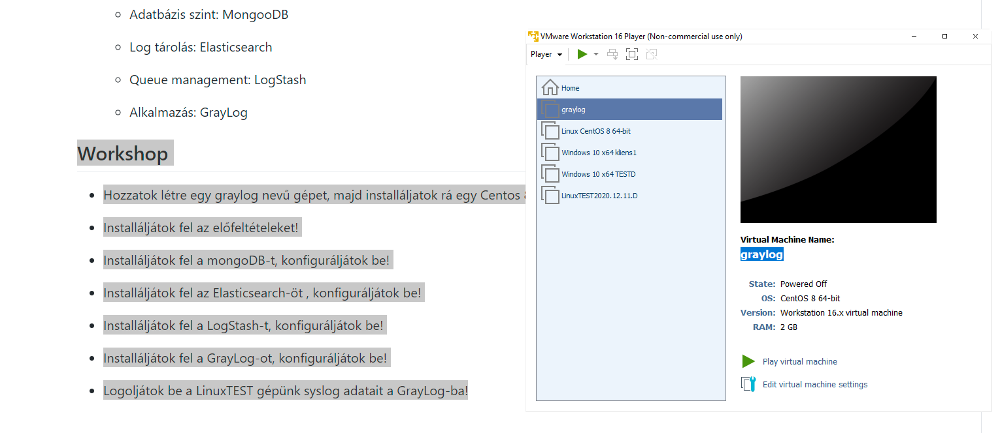
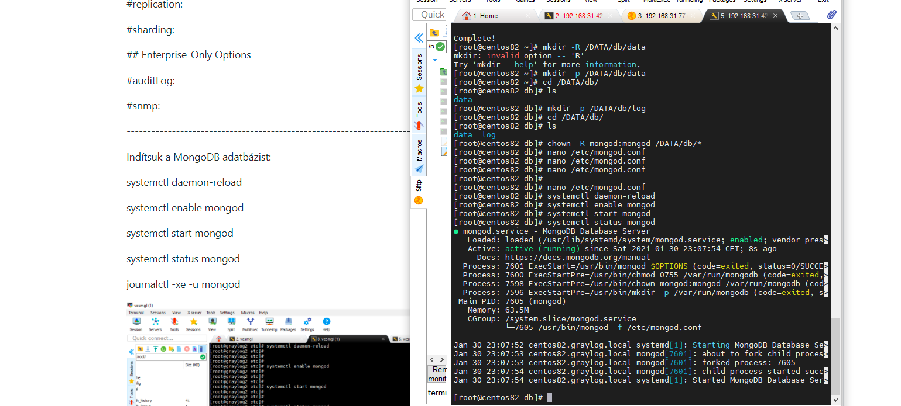
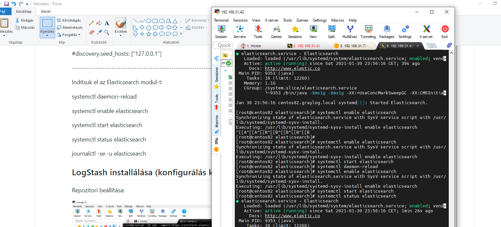
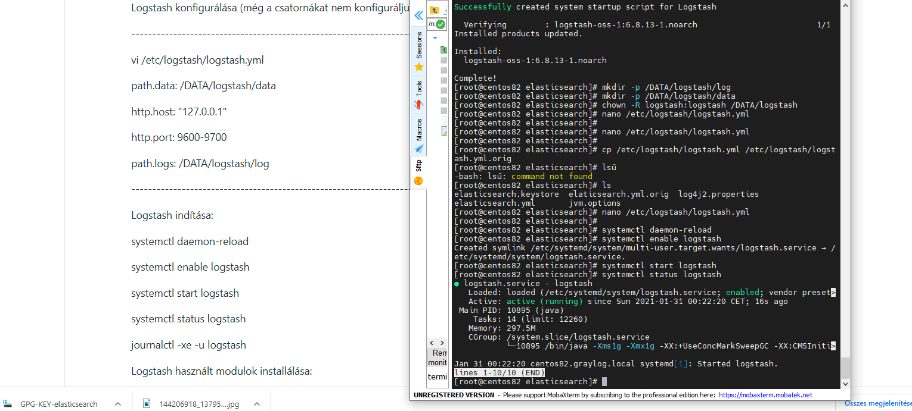
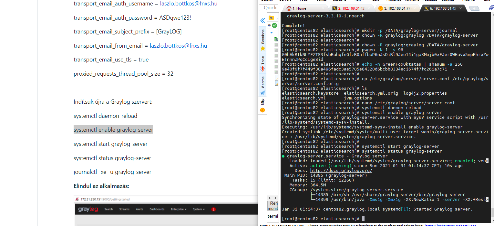
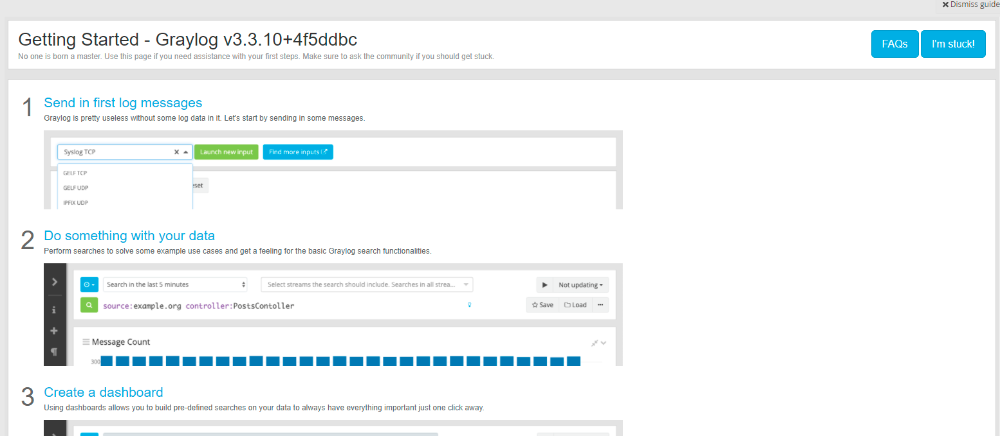
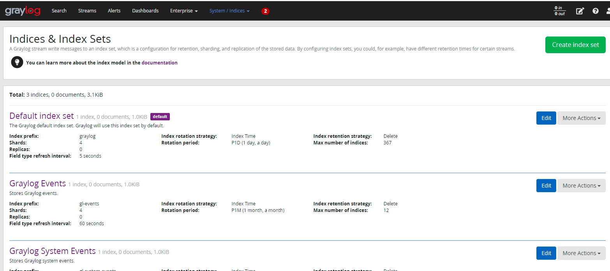

## Workshop

### Hozzatok létre egy graylog nevű gépet, majd installáljatok rá egy Centos 8.2-t!

### Installáljátok fel az előfeltételeket!

### Installáljátok fel a mongoDB-t, konfiguráljátok be!

### Installáljátok fel az Elasticsearch-öt , konfiguráljátok be!

### I(nstalláljátok fel a LogStash-t, konfiguráljátok be!

### Installáljátok fel a GrayLog-ot, konfiguráljátok be!

