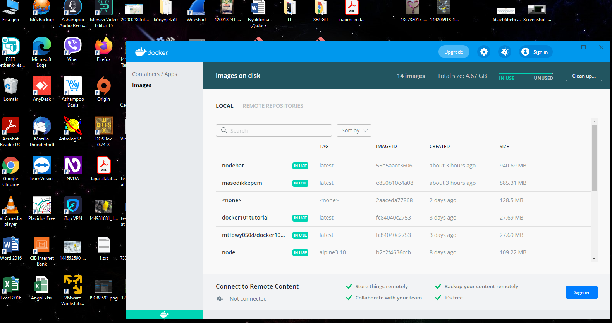
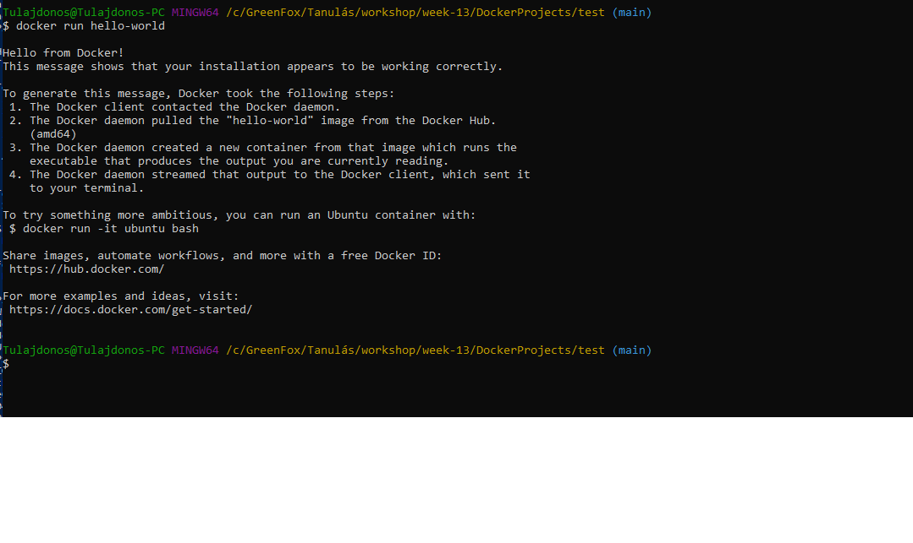
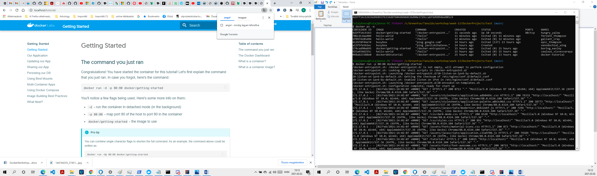
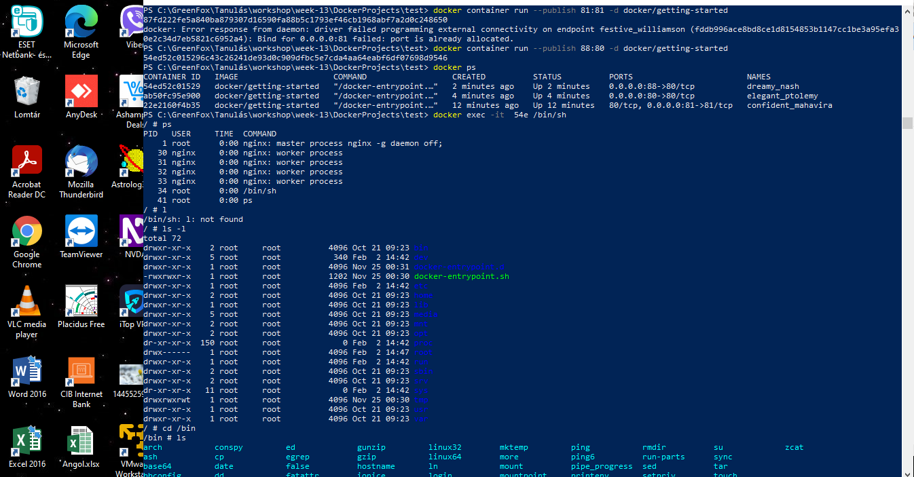
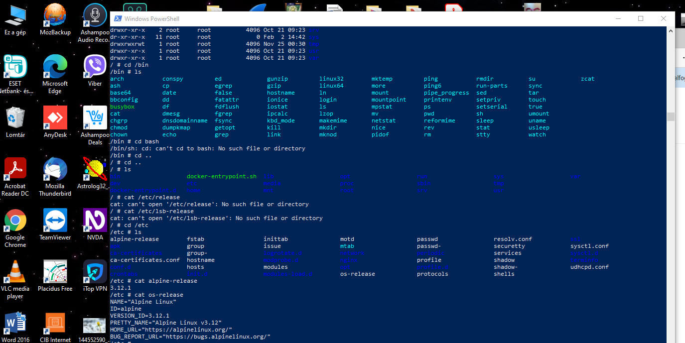
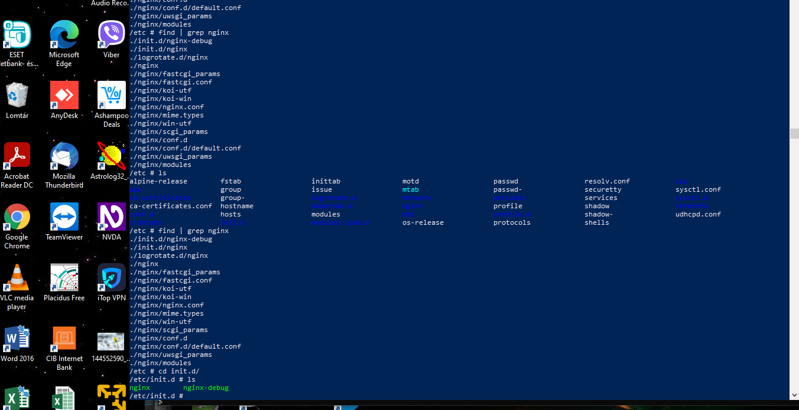

### Hello Docker
### Ha még nem tetted volna, telepítsd a Dockert a fenti videókban bemutatottak alapján!

### Próbáld meg elindítani a hello-world nevű konténert a gépeden. Ez a konténer nem sok mindent tud, viszont abban segít, hogy megtapasztald milyen lépésekből áll egy Docker konténer futtatása. Emellett megbizonyosodhatsz abban, hogy helyesen van telepítve a Docker a gépedre.

docker run hello-world
### Mit tapasztaltál?
#### Lefutott és kiírta ezt 

### Egészen sok dolog történt már így is, amiket érdemes megfigyelni:

Az egész folyamat úgy indult, hogy a Docker megnézte elérhető-e a hello-world nevű képfájl a gépeden, és nem találta.
Emiatt képfájl letöltésével kezdte, majd kiírta, hogy
Status: Downloaded newer image for hello-world:latest
Ezután elindult a konténer, kiírta az üdvözlőszöveget, és látszólag vége lett a folyamatnak
### Fut még a konténer?
#### Nem , leállt. (docker ps)
### Listázd az összes éppen futó konténert a gépeden! Mit látsz, fut még a hello-world?
### docker ps -a

### Indítsunk most el egy kicsivel összetettebb konténert! A getting-started szintén egy gyakorló képfájl, viszont

### docker run docker/getting-started
Az előző konténerrel ellentétben ez nem állt le, hanem folyamatosan fut! 

Tipp: a Ctrl + C kombinációval bármikor le tudod állítani a futást

### Hogyan kapom vissza a parancssort
### Szóval azt már látjuk, hogy vannak folyamatosan futó konténerek, de kérdés, hogy hogyan tudom elérni, hogy miközben a konténer fut, én tovább tudjam használni a parancssoromat?

Itt jön a képbe a -d kapcsoló.

### docker run -d docker/getting-started
### Listázd ismét a futó konténereket. Ha minden jól ment, akkor most látnod kell az előbb elindított konténert futni.

### Most állíts le minden futó konténert.
#### docker stop $(docker ps -a -q)
### Kapcsolat a külvilággal
### Az előbb említett docker/getting-started konténer a 80-as porton egy webszervert is üzemeltet, ezt viszont jelenleg nem tudjuk elérni, mivel alapértelmezetten az összes port el van rejtve előlünk.

### Old meg, hogy a böngészőbe a http://localhost:80-at beírva elérjük a fenti konténer által szolgáltatott weboldalt!
####  docker run -it -p 80:80 -v docker/getting-started

### Belépés a konténerbe
### Miután sikerült megfelelő módon elindítani a konténert, és ha minden jól megy, továbbra is fut, lépj be a konténerbe és nézz körül, milyen fájlok vannak!
#### docker exec -it  54e /bin/sh

### Ha rendszerüzemeltető szakirányon vagy (vagy csak simán kalandor), próbálj meg rájönni, hogy milyen Linux disztribúción fut a konténer!

### Próbálj meg rájönni, hogy milyen webszerver alkalmazás fut!

### Találd meg, hogy hol vannak a webalkalmazás fájljai!
Adatok megőrzése
Indítsd el egy adatbázis szervert (MySQL, SQL Server, vagy amit korábban is használtál) egy konténerben, úgy, hogy kívülről lehessen hozzá csatlakozni, ehhez természetesen keresned kell egy megfelelő képfájlt DockerHubon.
Csatlakozz az így létrehozott adatbázishoz, és hozz létre néhány táblát és töltsd fel adatokkal!
Állítsd le és töröld a konténert
Megmaradtak az adatbázis táblákba írt adataid? Ha nem, akkor old meg újra a feladatot úgy, hogy ha indítasz egy új adatbázis konténert, akkor a korábbi adataid újra elérhetővé váljanak!

További gyakorlás (angol tudás szükséges)
Az alábbi oldalon nagyszerű interaktív gyakorlófeladatokat találsz, amelyekhez kell egy kis angol tudás. Alakítsatok a tanulócsoportotokban kisebb gyakorlócsapatokat úgy, hogy minden csapatban legalább egy ember beszéljen jól angolul és segítsétek egymást a haladásban:

https://training.play-with-docker.com/ops-stage1/
