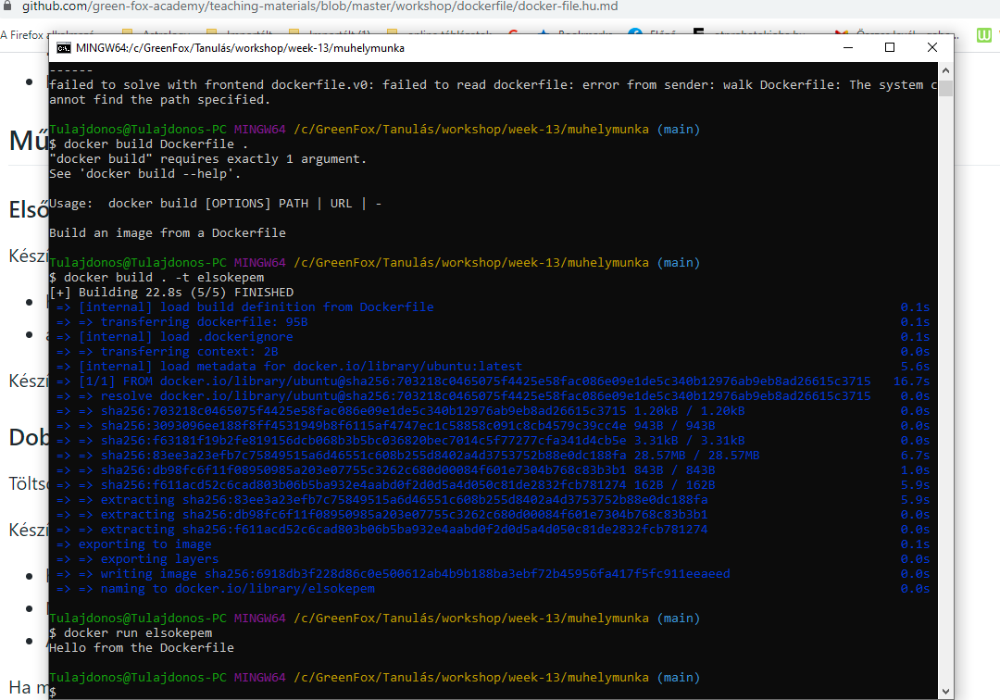
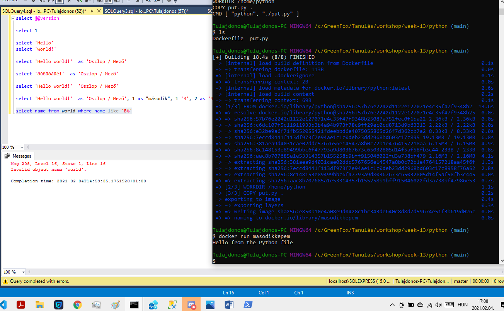
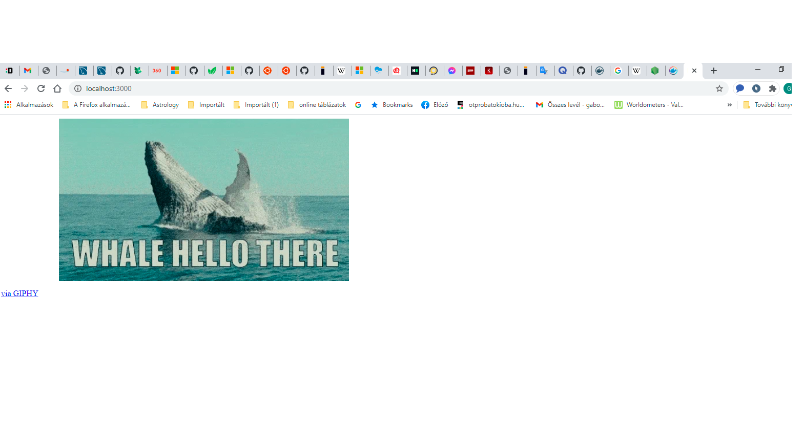

# Műhelymunka
## Első képem
### Készíts egy új Dockerfile-t:

### használt az ubuntu-t kiindulási képként (FROM ubuntu)
### a konténer indulásakor írasd ki, hogy "Hello from the Dockerfile"
### Készítsd el a képfájlt a fenti Dockerfile segítségével, és indítsd el a konténert próbaként.

## Dobozba zárt Python
### Töltsd le és használd a linkelt Python forrásfájlt.

### Készíts egy új Dockerfile-t:

### használt az python-t kiindulási képként
### Másold be a készülő konténerbe a fenti letöltött Python fájlt
### A konténer indulásakor futtasd le az átmásolt Python fájlt
### Ha mindent jól csináltál, akkor azt fogja kiírni, hogy "Hello from the Python file".

## Node.js app Dockerben
### Ezen a linken egy egyszerű Node.js appot találsz, amelyet konténerizálnod kell.

### Az app három fájlból áll, a package.json, package-lock.json és app.js, mindegyikre szükség van az app futtatásához, így töltsd le az összeset.

### Készíts egy új Dockerfile-t:

### használd a hivatalos Node.js Docker képfájlt kiindulásként
### Másold be a készülő konténerbe a fenti letöltött fájlokat
### Telepítsd a szükséges függőségeket az npm install paranccsal
### A konténer indulásakor futtasd az appot a npm start utasítással
### Az alkalmazás a 3000 portot használja, old meg, hogy a külvilág számára elérhető legyen ez a port.

### Nézd meg a http://localhost:3000 oldalon munkád gyümölcsét!

Konténerizálj minden dolgot!
