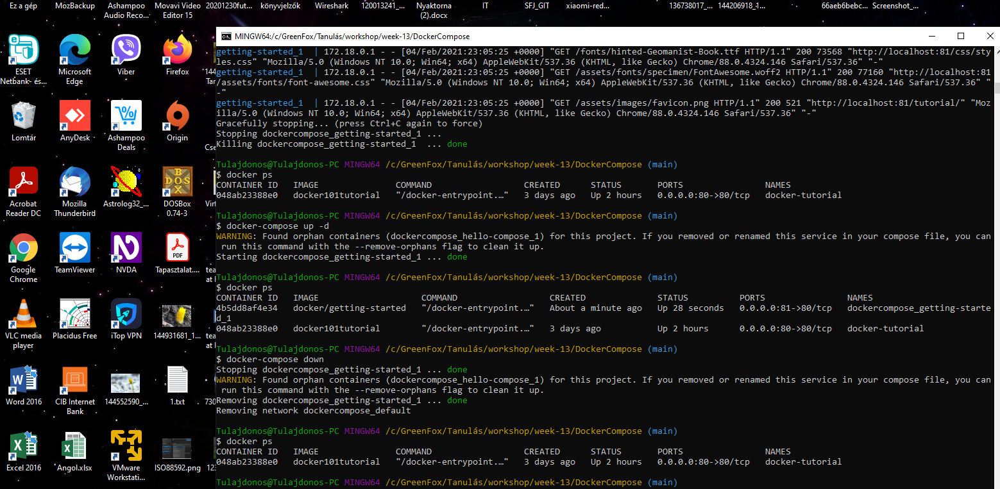
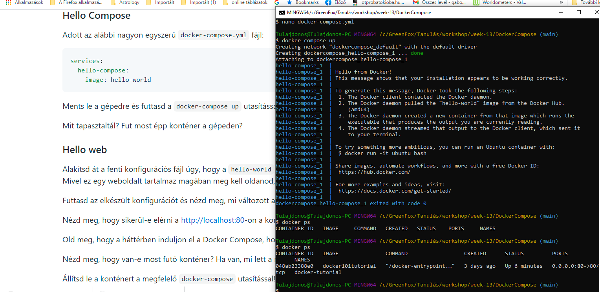
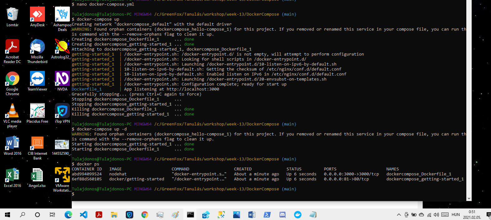

# Műhelymunka
## Hello Compose
###Adott az alábbi nagyon egyszerű docker-compose.yml fájl:

### services:
###  hello-compose:
###    image: hello-world
### Ments le a gépedre és futtasd a docker-compose up utasítással! (Figyelj oda, hogy a Docker fusson a gépeden!)
### Mit tapasztaltál? Fut most épp konténer a gépeden?

## Hello web
### Alakítsd át a fenti konfigurációs fájl úgy, hogy a hello-world kép helyett a már korábban megismert docker/getting-started képet használod. Mivel ez egy weboldalt tartalmaz magában meg kell oldanod, hogy a készülő konténer 80-as portja elérhető legyen a külvilág számára.

### Futtasd az elkészült konfigurációt és nézd meg, mi változott az előző verzióhoz képest.

###Nézd meg, hogy sikerül-e elérni a http://localhost:80-on a konténer weboldalát.

### Old meg, hogy a háttérben induljon el a Docker Compose, hogy tudd a továbbiakban használni a parancssort.

### Nézd meg, hogy van-e most futó konténer? Ha van, mi lett a neve?

### Állítsd le a konténert a megfelelő docker-compose utasítással!

## Saját képpel
### Az előző gyakorlásból ha minden jól megy van egy pár Dockerfile-od. Válaszd ki az egyiket, és kösd össze a fenti Docker Compose konfigurációval.
