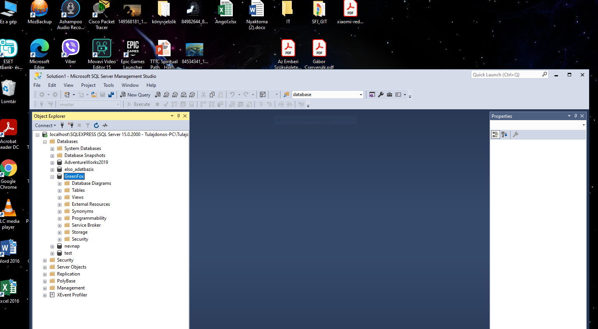

## Workshop

Az SQL paarncsok megismerése után minden (legkésőbb csütörtökre, péntekre) nap készíts legaláb 5-5 SQL lekérdezést vagy más parancsból példát akár a napi bemutatók alapján!

A megismert ismeretanyafg alapján mindenki találjon ki néhány általa érdekesnek gondolt feladatot és próbálja meg saját maga megoldani. Ha sikerül akkor mutassa be / ossza meg velünk is, vagy ha nem sikerül, akkor jelezze és együtt is megpróbáljuk megoldani a hét második részében.

### Telepítsünk Microsoft SQL szervert a gépünkre vagy valamelyik virtuális környezetünkbe!

### Hogy hívják a Microsoft SQL Server SQL nyelvvariációját?
#### (strukturált lekérdezőnyelv) relációsadatbázis-kezelők lekérdezési nyelve. https://hu.wikipedia.org/wiki/Rel%C3%A1ci%C3%B3sadatb%C3%A1zis-kezel%C5%91_rendszer 

#### A Microsoft SQL Server egy relációs adatbázis-kezelő rendszer vagy RDBMS (Relational DataBase Management System), amelyet a Microsoft fejleszt és forgalmaz. A többi RDBMS szoftverhez hasonlóan a Microsoft SQL Server az SQL tetejére épül, amely egy szabványos programozási, lekérdezési nyelv a relációs adatbázisokkal való interakcióhoz. A Microsoft SQL szerver a Transact-SQL-hez vagy a T-SQL-hez van kötve, amely a Microsoft saját SQL-implementációja, mely hozzáadja Microsoft saját speciális SQL programozási funkcióit.

#### Van-e ingyenes Micorsoft SQL szerver?
#### A Microsoft SQL Server négy elsődleges kiadással rendelkezik, amelyek különböző csomagokkal és szolgáltatásokkal rendelkeznek ebből két kiadás érhető el ingyenesen:
     
 #### Microsoft SQL Server Developer Edition adatbázis fejlesztéshez és teszteléshez.
     
 #### Microsoft SQL Server Express Edition-t kis adatbázisokhoz, 10 GB-os lemezterületig.
     
 #### Nagyobb és kritikusabb alkalmazások esetén a Microsoft SQL Server az Enterprise Edition-t kínálja, amely tartalmazza az SQL szerver összes szolgáltatását, míg a Microsoft SQL Server Standard Edition csak az Enterprise Edition részleges szolgáltatáskészleteivel rendelkezik, és korlátozza a kiszolgálót méretét is a felhasználható processzormag és az adatfeldolgozáshoz konfigurálható memória méretének tekintetében.
     
### Mi a Microsoft SQL Server két fő összetevője?
#### adatbázis motor
#### SQLOS

### Lehet-e Microsoft Windows 10 operácisós rendszerre Microsoft SQL szerver telepíteni?
#### Szoftveres és operációs rendszer szintű követelmények:     
#### Windows 10 TH1 1507 vagy újabb verzió   
#### Windows Server 2016 vagy újabb szerver verzió

### Hogyan lehet SQL-ben megjegyzéseket írni?
#### A megjegyzésnek szánt sor elejére (--) dupla kötőjelet írunk, majd szóköz után jön a szöveg pl: -- text_of_comment

### Van-e a Microsoft SQL szerverhez ingyenes a Microsoft által készített menedzsment eszköz?
#### a Microsoft SQL szerverhez van egy ingyenes a Microsoft által készített menedzsment eszköz is, aminek a segítségével grafikus felületen keresztül lehet a szerver beállításait kezelni, illetve SQL parancsokat végrehajtani.

### Hogy hívják ezt a menedzsment eszközt?
#### SQL Server Express

### Hogy hívják az SQL Express alap SQL példányát amihez csatlakozni tudunk?
#### Microsoft SQL Server Standard Edition

### Érdemes-e az SQL szerver paramétereit elállítani?
#### attól, függ hogy mit akarunk csinálni.pl.perfomance tuningra mindenképp kell állítani.

### Melyik az az SQL parancs amivel ebben az alaptanfolyamban megismerkedtünk és a legtöbb példában használtuk?
#### SELECT

### A háram SQL parancsosztály közül ez melyiknek a tagja?
#### DML (Data Management Language, adatkezelési nyelv) - ezek a parancsok segítenek az adatbázisban lévő adatok lekérdezésében és kezelésében. Például: SELECT, INSERT, UPDATE, DELETE

### Mi a célja / mit lehet vele csinálni az Execute gombnak a menedzsment felületen?
#### Az "Execute" gombra kattintva tudjuk a beírt utasításokat lefuttatni.

### Mi a gyorsbillentyű megfelelője?
#### Ctrl+e

### Lehet-e "Hello World!" példprogramot készíteni SQL-ben?
#### Lehet. select 'Hello world!'

### Mindenki számolja ki a születési idejét másodpercben SQL select parancs segítségével!
#### select DATEDIFF( yy, '1971-10-13', GETDATE() )          50
#### select DATEDIFF( ww, '1971-10-13', GETDATE() )        2578
#### select DATEDIFF( d, '1971-10-13', GETDATE() )        18044 
#### select DATEDIFF( mi, '1971-10-13', GETDATE() )    25983377 
#### select DATEDIFF( s, '1971-10-13', GETDATE() )   1590493978   2021.03.08.12:17:58 AM

