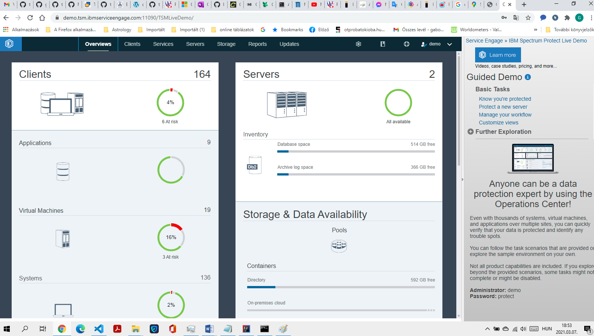
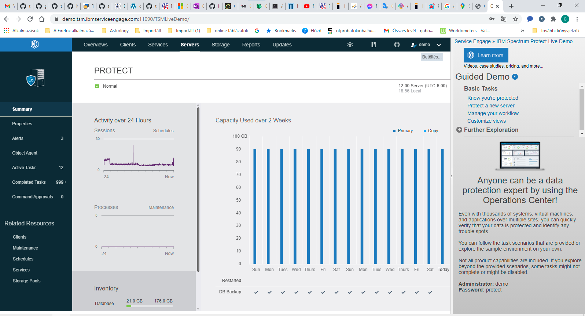

## Workshop

### Mi a mentés és az archiválás közötti különbség?
#### mentés: üzletfolytonosság biztosítására
#### archiválás: referenciaidőpontoknak a megőrzésére

### Hol érdemes tárolni a mentett adatainkat?

#### Az aktív rendszerektől fizikailag eltérő helyen tárolva

### Minimálisan hány példányban érdemes tarttani a mentéseinket?
#### minimum kettő, de ajánlott három 

### A mentés inkább CPU vagy inkább I/O igényes művelet?
#### I/O igényes művelet

### Az internete mindenki nyissa meg az IBM Spectrum Protect demó oldalát és probáljon ki néhény funciót az ottani felületen! link
#### https://demo.tsm.ibmserviceengage.com:11090/TSMLiveDemo/ 

### Mindeki végezzen számításokat arra, hogy 100GB, 200GB, 500GB, 1TB, 2TB adat különböző médiákon (szalag, LAN, SAN) mennyi ideig tartana lementeni!
#### https://wintelguy.com/transfertimecalc.pl/?F1=100&unf=98&R1=100&unr=611 

### A délutáni gyakorlatok alatt keress az interneten mentéssel kapcsolatos hardver megoldásokat, szalagos meghajtókat, szalagkönyvtárakat és virtuális szalagos megoldásokat!
#### http://www.invigor.hu/szolgaltatasaink/hardveres-megoldasok/ 

### A délutáni gyakorlatok alatt keress az interneten mentéssel kapcsolatos szoftver megoldásokat!
#### Felhő alapú Mentés: https://buy.hpe.com/emea_europe/en/enterprise-solutions/cloud-solutions/storage-cloud-saas-solutions/storage-cloud-saas-solutions/hpe-cloud-volumes-backup/p/1013033925
#### Szalagkönyvtár: https://hp-portal.hu/index.php?route=product/product&product_id=191846&from=argep
#### Szalagos meghajtó: https://www.kimbrer.hu/hp-652734-001.html?gclid=EAIaIQobChMI8cnKw6KA7wIVr0eRBR3yEQZBEAQYAyABEgL9-_D_BwE
#### Virtuális szalagos mentés: https://www.starwindsoftware.com/starwind-virtual-tape-library

A lenti megadott linkek alapján nézd meg és próbáld ki a mentési megoldásokhoz kapcsolódó ingyenes vagy próba szoftvertermékeket (dd, rsync, ...)!

Termék linkek:

https://www.veeam.com/downloads.html

http://service.boulder.ibm.com/storage/tivoli-storage-management/

Mivel ez a bevezető tanfolyam nem rendelkezik semmilyen hardver infrastruktúrával a SAN, mentés és a tárolóeszközök témához, ezért itt ebben a tanfolyamban csak az oktató által bemutatott feladatokat tudjuk magunk is gyakorolni, ezért mindenki töltsön le az egyik választott vagy akár mindkét bemutatott mentési megoldásból szoftverkomponeneseket vagy az ingyenes megoldások közül néhányat és próbálja meg a megszerzett információk alapján hasnzálni vagy a képernyőképek alapján megismételni a telepítési lépeseket, egyszerű konfigurációs beállításokat.